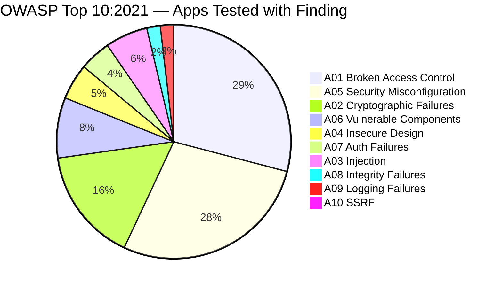

The OWASP Top 10 is the industry-standard list of the most critical web application security risks. Updated periodically by the Open Web Application Security Project, it serves as the baseline for any web security program.

Current edition: **OWASP Top 10:2021**



---

## A01 — Broken Access Control

**What:** The application does not enforce what authenticated users are allowed to do. Users can access data or actions outside their permissions.

**Examples:**
- Changing `/api/users/123` to `/api/users/124` and accessing another user's account (IDOR)
- Forcing browse to `/admin` without being an admin
- Elevating privileges by modifying a role in the JWT payload

**Defenses:**
- Enforce authorization server-side on every request — never rely on what the client sends for permission decisions
- Default deny: if an explicit allow rule isn't matched, deny access
- Use indirect object references (database UUIDs not sequential integers) plus ownership checks
- Log access control failures; alert on repeated failures from the same identity

---

## A02 — Cryptographic Failures

**What:** Sensitive data is exposed due to weak or absent encryption. This was previously called "Sensitive Data Exposure."

**Examples:**
- Passwords stored as unsalted MD5 hashes
- PII transmitted over HTTP
- Encryption keys hardcoded in source code
- Using ECB mode for block cipher encryption

**Defenses:**
- Never store passwords with reversible encryption — use Argon2id, bcrypt, or scrypt
- Enforce HTTPS everywhere; HSTS with `includeSubDomains`
- Use AES-256-GCM for symmetric encryption; never ECB mode
- Store encryption keys in a secrets manager (Vault, AWS KMS), not source code

---

## A03 — Injection

**What:** Attacker-controlled data is interpreted as code or commands by an interpreter. SQL, LDAP, OS command, and template injection all fall here.

**SQL Injection example:**
```sql
-- Vulnerable query built with string concatenation:
SELECT * FROM users WHERE email = '" + email + "'

-- Attacker input: ' OR '1'='1
-- Resulting query:
SELECT * FROM users WHERE email = '' OR '1'='1'  -- returns all rows
```

**Defenses:**
- Parameterized queries / prepared statements — the only reliable defense against SQLi
- ORM query builders (but beware raw query escape hatches)
- Input validation: reject unexpected characters at the boundary
- Least-privilege database accounts — the app user should not have `DROP TABLE` permission

See [Input Validation](/security/api/input-validation) and [SQL Injection](/security/web/sql-injection) for full coverage.

---

## A04 — Insecure Design

**What:** Security flaws baked into the architecture — not implementation bugs but missing or flawed security controls by design.

**Examples:**
- Password reset flow that leaks whether an email exists in the system (account enumeration)
- "Security questions" as the only recovery mechanism
- No rate limiting on credential endpoints by design

**Defenses:**
- Threat model during design phase — identify assets, threats, and controls before writing code
- Security requirements as part of user stories
- Reference architectures and secure design patterns

---

## A05 — Security Misconfiguration

**What:** Correct software incorrectly configured. The most common finding in security assessments.

**Examples:**
- Default credentials left on admin panels
- Stack traces and debug output exposed in production
- S3 bucket set to public
- Unnecessary services, ports, or features left enabled
- Missing security headers

**Defenses:**
- Infrastructure as code with security defaults baked in
- Automated config scanning (cloud security posture management)
- HTTP security headers — see [HTTP Security Headers](/auth/implementation/http-security-headers)
- Remove/disable any service, port, or feature not actively used

---

## A06 — Vulnerable and Outdated Components

**What:** Using dependencies with known vulnerabilities, or running outdated software versions.

**Examples:**
- npm package with a published CVE still in `package.json`
- End-of-life OS or runtime (Node 14, Python 2)
- Log4Shell (CVE-2021-44228) — a single vulnerable library in millions of apps

**Defenses:**
- `npm audit` / `pip-audit` / `trivy` in CI — fail builds on high-severity CVEs
- Dependabot or Renovate for automated dependency PRs
- Maintain a software bill of materials (SBOM)
- Subscribe to security advisories for key dependencies

---

## A07 — Identification and Authentication Failures

**What:** Weaknesses in authentication logic — previously called "Broken Authentication."

**Examples:**
- Permitting brute force with no rate limiting or lockout
- Weak session IDs (short, predictable, not regenerated on login)
- Storing plaintext or weakly hashed passwords

**Defenses:**
- Rate limit and lock out credential endpoints
- Regenerate session IDs on login
- Enforce strong password policies; check against breach databases
- MFA for all accounts

See the full [Auth section](/auth) for comprehensive coverage.

---

## A08 — Software and Data Integrity Failures

**What:** Assumptions about software updates, critical data, and CI/CD pipelines without verifying integrity.

**Examples:**
- Deserializing untrusted data without validation (Java deserialization attacks)
- Auto-updating from an unsigned CDN source
- CI/CD pipeline that pulls and executes an unverified build script
- SolarWinds-style supply chain compromise

**Defenses:**
- Verify signatures on downloaded software and updates
- Pin dependency hashes in lock files (`package-lock.json`, `Pipfile.lock`)
- Restrict who can modify CI/CD pipelines; require code review
- Disable insecure deserialization — prefer JSON over native object serialization

---

## A09 — Security Logging and Monitoring Failures

**What:** Insufficient logging and alerting means breaches go undetected. The average breach dwell time is over 200 days.

**Examples:**
- Login failures not logged
- No alerting on spike in 403 errors
- Logs stored only on the compromised system (lost during incident)

**Defenses:**
- Log all authentication events (success, failure, logout, password reset)
- Ship logs to a SIEM or centralized log store separate from app servers
- Alert on anomalies: unusual volume, unexpected geos, after-hours admin access
- Retain logs for at least 12 months (required for many compliance frameworks)

See [Logging & Monitoring](/security/incident-response/logging-monitoring) for implementation details.

---

## A10 — Server-Side Request Forgery (SSRF)

**What:** The application fetches a remote resource using a URL supplied or influenced by the attacker. The server makes the request with its own identity and network access.

```
Attacker → App → http://169.254.169.254/latest/meta-data/  (AWS instance metadata)
                → http://internal-db:5432/                  (internal network)
                → file:///etc/passwd                         (local filesystem)
```

**Defenses:**
- Validate and allowlist URLs the server will fetch — scheme, host, and port
- Block requests to RFC1918 private ranges and link-local addresses (`169.254.0.0/16`)
- Use a dedicated egress proxy with allowlisting
- Disable HTTP redirects on server-side fetch clients, or validate after redirect

---

## OWASP Risk Rating Summary

| # | Category | Incidence Rate | CVEs Mapped |
|---|---|---|---|
| A01 | Broken Access Control | 94% of apps tested | 34 |
| A02 | Cryptographic Failures | 51% | 29 |
| A03 | Injection | 19% | 274 |
| A04 | Insecure Design | 4% | 40 |
| A05 | Security Misconfiguration | 90% | 208 |
| A06 | Vulnerable Components | 27% | 0 (data-driven) |
| A07 | Auth Failures | 14% | 8 |
| A08 | Integrity Failures | 6% | 10 |
| A09 | Logging Failures | 6% | 3 |
| A10 | SSRF | 2.7% | 16 |
