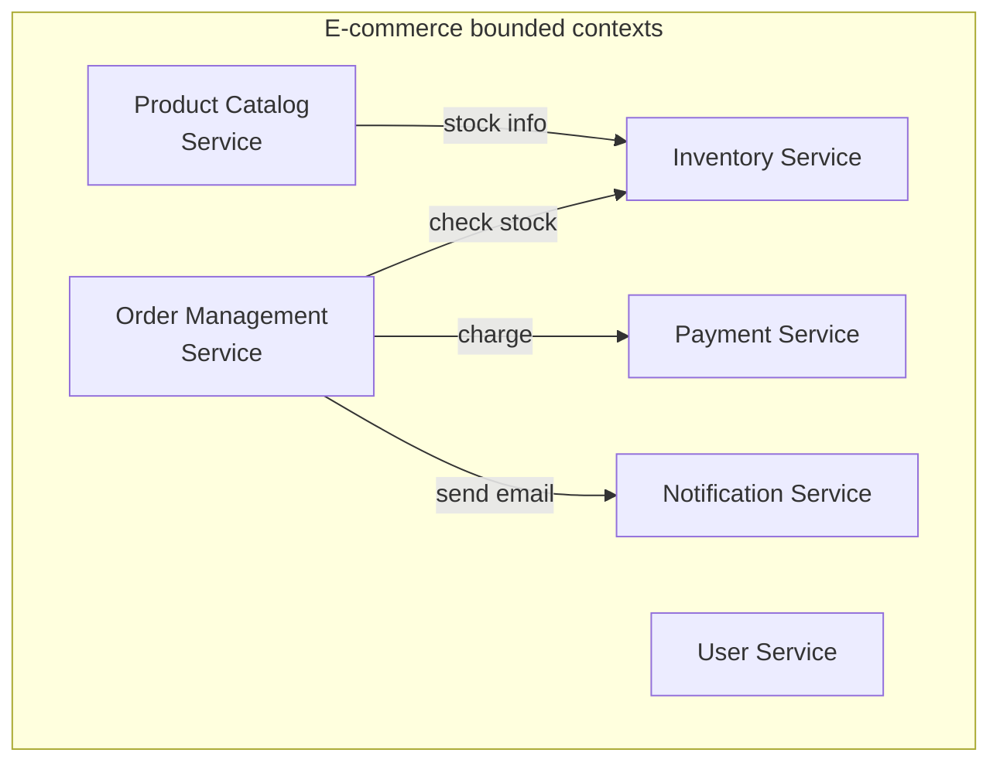
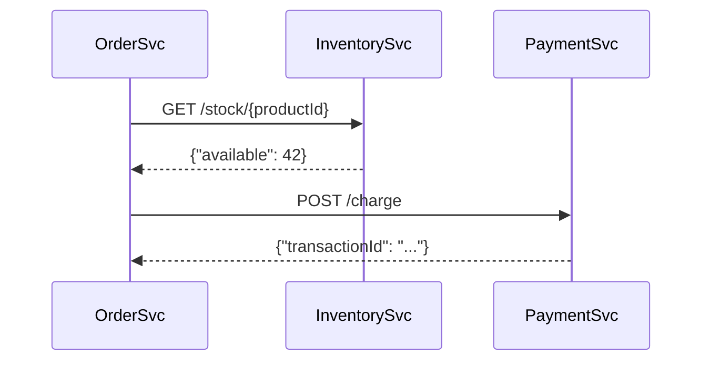
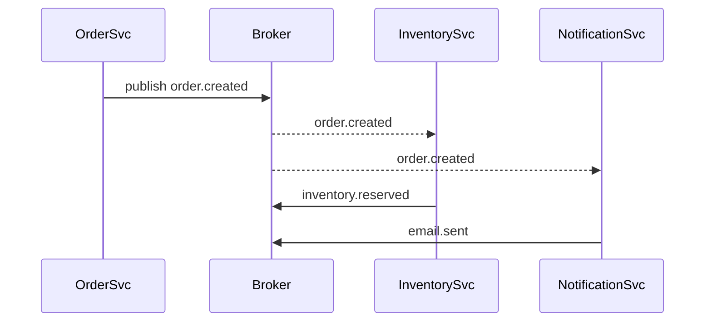

Microservices decompose an application into small, independently deployable services, each owning its own data store and communicating over a network. The benefit is independent scalability and team autonomy. The cost is distributed systems complexity.

## Core principles

- **Single responsibility** — each service does one thing well
- **Own your data** — services don't share databases; they own their tables
- **Communicate over APIs** — no shared memory, only network calls or events
- **Independent deployment** — a service can be deployed without coordinating with others
- **Failure isolation** — a service crashing doesn't cascade (with proper circuit breakers)

## Service decomposition

Decompose around **bounded contexts** from Domain-Driven Design (DDD) — business subdomains with their own language, entities, and rules.



### Domain-Driven Design heuristics

- Nouns with complex behaviour → service candidate
- Different teams own different parts → service boundary
- Different scaling needs → service boundary
- Different update frequencies → service boundary

## Inter-service communication

### Synchronous (request/response)



- Direct HTTP/REST or gRPC calls
- Simple to reason about
- Tight coupling — caller must wait; if inventory is down, orders fail
- Use circuit breakers and timeouts

### Asynchronous (event-driven)



- Decoupled — OrderSvc doesn't know about downstream consumers
- Resilient — consumers can lag or restart
- Complex — eventual consistency, hard to debug
- Use for side effects, fan-out, and cross-service state sync

## Resilience patterns

### Circuit Breaker

Prevents cascading failures when a downstream service is slow or failing:

```javascript
import CircuitBreaker from 'opossum';

const options = {
    timeout: 3000,         // call fails if > 3s
    errorThresholdPercentage: 50,  // open if > 50% fail
    resetTimeout: 30000,   // retry after 30s
};

const breaker = new CircuitBreaker(callInventoryService, options);

breaker.on('open',    () => logger.warn('Circuit OPEN — inventory service failing'));
breaker.on('halfOpen',() => logger.info('Circuit HALF-OPEN — testing'));
breaker.on('close',   () => logger.info('Circuit CLOSED — service recovered'));

// States: CLOSED (normal) → OPEN (failing, reject fast) → HALF-OPEN (probe)
```

### Retry with exponential backoff

```javascript
async function callWithRetry(fn, maxRetries = 3) {
    for (let attempt = 1; attempt <= maxRetries; attempt++) {
        try {
            return await fn();
        } catch (err) {
            if (attempt === maxRetries) throw err;
            const delay = Math.min(1000 * 2 ** attempt + Math.random() * 1000, 30000);
            await new Promise(r => setTimeout(r, delay));
        }
    }
}
```

**Jitter** (random delay) prevents all retrying clients from hitting a recovering service simultaneously (thundering herd).

### Timeout

Always set timeouts on outbound calls. No timeout = threads accumulate waiting for a response that never comes → out of memory → cascading failure.

```javascript
const controller = new AbortController();
const timeout = setTimeout(() => controller.abort(), 5000);

try {
    const res = await fetch('http://inventory/stock/42', { signal: controller.signal });
    return res.json();
} finally {
    clearTimeout(timeout);
}
```

### Bulkhead

Isolate failures by limiting concurrent calls to a dependency:

```javascript
import Bottleneck from 'bottleneck';

const inventoryLimiter = new Bottleneck({ maxConcurrent: 10, minTime: 0 });
const paymentLimiter   = new Bottleneck({ maxConcurrent: 5,  minTime: 0 });

const stock = await inventoryLimiter.schedule(() => callInventory(productId));
```

## Data management patterns

### Database per service

Each service owns its own database. Cross-service queries replaced by API calls or event-driven denormalisation.

```
Orders DB (PostgreSQL)   |  Inventory DB (PostgreSQL)
Products DB (MongoDB)    |  Users DB (MySQL)
```

### CQRS — Command Query Responsibility Segregation

Separate the write model from the read model:

```mermaid
flowchart LR
    Client -->|Command\n(write)| CommandHandler
    CommandHandler --> WriteDB[(Write DB)]
    WriteDB -->|Events| Projector
    Projector --> ReadDB[(Read DB\n / projections)]
    Client -->|Query\n(read)| QueryHandler
    QueryHandler --> ReadDB
```

The read model can be a denormalised projection optimised for queries — different from the normalised write model. Updated asynchronously via events.

## Distributed transactions

ACID transactions don't work across services. Use the Saga pattern instead.

### Saga — Choreography

Each service publishes events; others listen and react:

```
OrderSvc: publish order.created
  → InventorySvc: reserve stock → publish inventory.reserved
  → PaymentSvc: charge card → publish payment.charged
  → OrderSvc: listen to both → mark order confirmed

On failure:
  → PaymentSvc fails → publish payment.failed
  → InventorySvc: listen → release reserved stock (compensating transaction)
```

### Saga — Orchestration

A central orchestrator calls each step:

```javascript
// Order saga orchestrator
async function executeOrderSaga(orderId) {
    try {
        await inventoryService.reserve(orderId);
        await paymentService.charge(orderId);
        await orderService.confirm(orderId);
    } catch (err) {
        await compensate(orderId, err.failedStep);
    }
}
```

## Service discovery

Services need to find each other. Options:
- **DNS-based** — Kubernetes services resolve via cluster DNS (`http://inventory-svc:3001`)
- **Service registry** — Consul, Eureka — services register on start, clients query
- **Load balancer** — proxy handles routing (Nginx, Envoy, AWS ALB)

## API Gateway

A single entry point for clients:

```
Client → API Gateway → route to services
                     → auth/rate-limit/logging in one place
```

Products: Kong, AWS API Gateway, NGINX, Traefik, Envoy.

## Observability in microservices

Without distributed tracing, debugging is nearly impossible:

- **Correlation ID** — propagate a request ID across all service calls
- **Distributed tracing** — Jaeger, Zipkin, OpenTelemetry
- **Centralised logging** — Loki, Elasticsearch
- **Service mesh metrics** — Istio/Envoy expose RED metrics per service

```javascript
// Propagate trace headers
app.use((req, res, next) => {
    const traceId = req.headers['x-trace-id'] ?? crypto.randomUUID();
    req.traceId = traceId;
    res.setHeader('x-trace-id', traceId);
    next();
});
```
