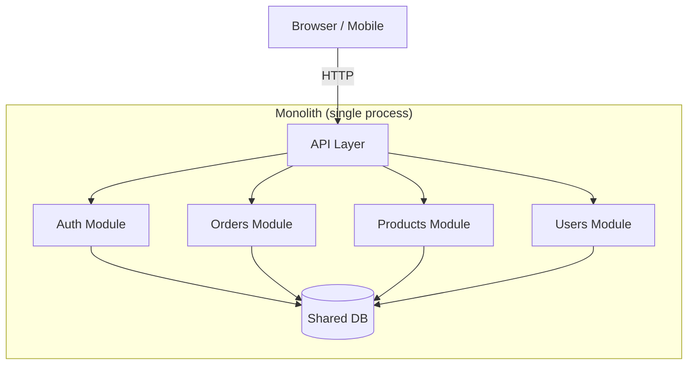
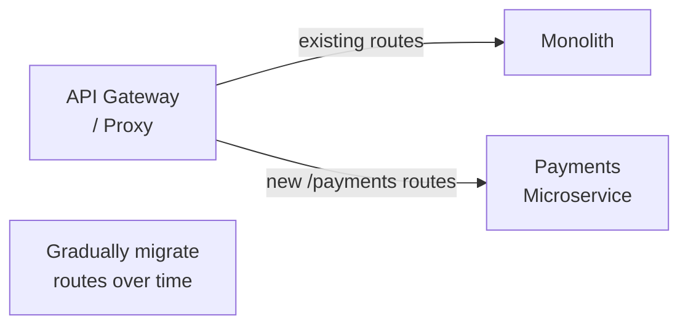

A monolith is a single deployable unit containing all application logic. Despite the industry narrative, monoliths are a perfectly valid choice — often the *right* choice — especially for teams under ~50 engineers and systems under ~10 million daily users.

## What makes something a monolith

- Single codebase, single deployable artefact
- All components share the same process and memory space
- Single database (typically)
- Scaled by running multiple copies of the whole thing



## Why monoliths get a bad reputation

The problem is rarely "monolith" — it's **unmanaged coupling**. A big ball of mud where every module depends on every other module is hard to change regardless of deployment topology. The solution is modular design, not necessarily microservices.

## Advantages of monoliths

| Advantage | Detail |
|---|---|
| **Simplicity** | One codebase, one deployment, one debugger session |
| **In-process calls** | Cross-module calls are function calls, not network hops |
| **Transactions** | ACID transactions across all modules trivially |
| **Refactoring** | Rename a function — IDE finds every caller |
| **Testing** | Integration tests run in a single process |
| **Deployment** | One image to build, one service to monitor |
| **Onboarding** | Clone the repo, run one command |

## The modular monolith

A modular monolith enforces clear module boundaries within a single deployable, preventing the big ball of mud:

```
src/
├── modules/
│   ├── orders/
│   │   ├── orders.controller.ts
│   │   ├── orders.service.ts
│   │   ├── orders.repository.ts
│   │   └── orders.module.ts
│   ├── products/
│   └── users/
├── shared/
│   ├── database/
│   ├── auth/
│   └── events/       ← internal event bus for cross-module comms
└── app.ts
```

Rules:
- Modules communicate only through published interfaces (service classes)
- No direct DB table access across module boundaries
- Prefer events for side effects that cross modules

```typescript
// orders.service.ts
// NOT: import { UserRepository } from '../users/user.repository';
// CORRECT: import { UserService } from '../users/user.service';
export class OrdersService {
    constructor(
        private userService: UserService,  // public interface only
        private ordersRepo: OrdersRepository,
        private events: EventBus,
    ) {}

    async createOrder(dto: CreateOrderDto) {
        const user = await this.userService.findById(dto.userId);
        const order = await this.ordersRepo.create({ ...dto, userEmail: user.email });
        await this.events.emit('order.created', { orderId: order.id });
        return order;
    }
}
```

## When to choose a monolith

**Choose monolith when:**
- Team is small (< 15 engineers)
- Domain is not yet well understood
- Speed of initial development matters
- You don't have platform engineering capacity to run distributed systems
- Operational overhead of many services would outweigh benefits

**Choose microservices when:**
- Different parts of the system need to scale independently at very different rates
- Teams are large enough that shared codebase becomes a bottleneck
- Parts of the system have very different deployment cadences or technology needs
- You have the platform infrastructure to operate them (Kubernetes, service mesh, distributed tracing)

## Performance characteristics

Monoliths have an inherent advantage for same-process calls:

| Call type | Typical latency |
|---|---|
| In-process function call | < 1 µs |
| Redis cache hit | 0.1–1 ms |
| Same-DC HTTP call | 1–5 ms |
| Cross-region HTTP call | 50–200 ms |

Microservices pay a minimum of 1–5 ms overhead per service boundary. For a request touching 5 services, that's 5–25 ms of unavoidable overhead before any business logic runs.

## Extracting services from a monolith

When a specific module needs to scale independently or be owned by a dedicated team, extract it:

### Strangler Fig pattern



1. Introduce a routing proxy in front of the monolith
2. Implement the new service alongside (not inside) the monolith
3. Route specific paths to the new service
4. Once complete, delete the module from the monolith

Never rewrite everything at once. Extract one module at a time with a clear rollback path.

## Database considerations

The hardest part of decomposing a monolith is the database. A shared DB with tight coupling makes extraction painful.

**Preparation for future extraction:**
- Enforce table ownership — each module only reads/writes its own tables
- No cross-module foreign keys (use loose references by ID)
- Use events to propagate state changes instead of direct joins

This allows you to physically separate the databases later by following the event streams.
