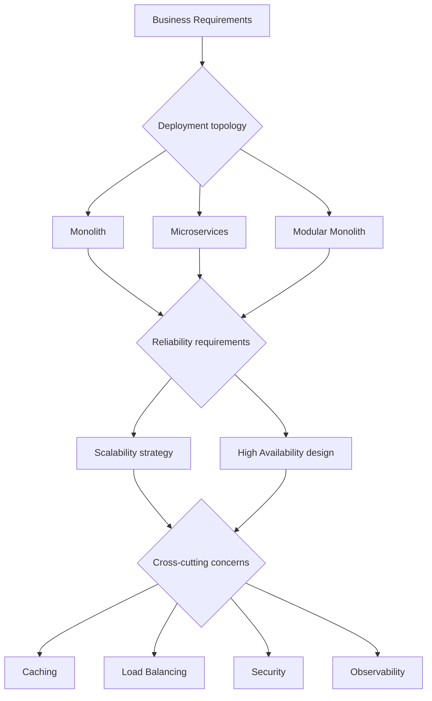

Software architecture is the set of decisions that shape a system's structure, capabilities, and constraints. Good architecture makes the right things easy and the wrong things hard. Bad architecture creates accidental complexity that compounds forever.

## Key architectural decisions

## Architecture quality attributes

These are the "-ilities" that architecture must explicitly address:

| Attribute | Question answered |
|---|---|
| **Scalability** | Can it handle 10× more load? |
| **Availability** | What fraction of time is it up? |
| **Reliability** | Does it behave correctly under failure? |
| **Maintainability** | Can a new engineer understand and change it? |
| **Testability** | Can components be tested in isolation? |
| **Security** | Is the attack surface minimised and controlled? |
| **Performance** | Does it meet latency and throughput targets? |
| **Observability** | Can you understand system state from its outputs? |
| **Deployability** | How fast and safely can you release changes? |

## The fundamental tension

Every architecture balances **simplicity** (monolith) against **independence** (microservices). The right answer depends on team size, domain complexity, and traffic patterns.

> "Don't let your tools or methodologies be smarter than your team's ability to operate them." — Rule of thumb

## Key areas in this section

| Topic | What you'll learn |
|---|---|
| [Monoliths](./monoliths) | When a monolith is the right choice and how to build one well |
| [Microservices](./microservices) | Service decomposition, IPC, resilience patterns |
| [Service Mesh](./service-mesh) | Istio, Linkerd, mTLS, observability at the network layer |
| [Distributed Systems](./distributed-systems) | CAP theorem, consensus, clock drift, distributed transactions |
| [Scalability](./scalability) | Horizontal vs vertical scaling, partitioning, stateless design |
| [High Availability](./high-availability) | SLOs, redundancy, failover, disaster recovery |
| [Caching](./caching) | Cache hierarchy, invalidation strategies, Redis patterns |
| [Load Balancing](./load-balancing) | Algorithms, L4 vs L7, health checks, session affinity |
| [Design Patterns](./design-patterns) | CQRS, event sourcing, saga, strangler fig, BFF |
| [Security](./security) | Defence in depth, zero trust, threat modelling |

## Decision framework

Use this framework when evaluating architectural choices:

1. **Start with requirements** — functional and non-functional
2. **Identify constraints** — team size, budget, existing systems, compliance
3. **Define quality attributes** — rank them (can't optimise for everything)
4. **Evaluate trade-offs explicitly** — document why you chose X over Y
5. **Prefer reversibility** — avoid decisions that are expensive to undo
6. **Evolve, don't over-engineer** — architecture should grow with the system
