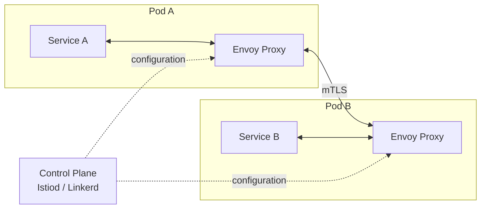

A service mesh is an infrastructure layer that handles service-to-service communication: mTLS encryption, load balancing, retries, circuit breaking, and observability — without requiring changes to application code.

## The problem it solves

In a microservices system every service needs:
- mTLS between services (auth + encryption)
- Retries and circuit breakers
- Distributed tracing
- Traffic shaping (canary, A/B)
- Rate limiting

Without a mesh, you implement this in every service's code. With a mesh, you configure it once in the control plane.

## Sidecar proxy model

Each service pod gets a **sidecar proxy** (typically Envoy) injected automatically. All network traffic goes through the proxy.



The apps connect to `localhost` — the proxy intercepts all traffic transparently via iptables rules.

## Key features

### mTLS — Mutual TLS

Every service gets a certificate from the mesh CA. All inter-service traffic is encrypted and both sides are authenticated automatically. No developer action required.

```yaml
# Istio: enforce strict mTLS across namespace
apiVersion: security.istio.io/v1beta1
kind: PeerAuthentication
metadata:
  name: default
  namespace: production
spec:
  mtls:
    mode: STRICT
```

### Traffic management

```yaml
# Istio: canary — send 10% traffic to v2
apiVersion: networking.istio.io/v1alpha3
kind: VirtualService
metadata:
  name: product-service
spec:
  http:
    - match:
        - headers:
            x-canary:
              exact: "true"
      route:
        - destination:
            host: product-service
            subset: v2
    - route:
        - destination:
            host: product-service
            subset: v1
          weight: 90
        - destination:
            host: product-service
            subset: v2
          weight: 10
```

### Retries and circuit breaking

```yaml
# Istio: retry policy
apiVersion: networking.istio.io/v1alpha3
kind: VirtualService
spec:
  http:
    - retries:
        attempts: 3
        perTryTimeout: 2s
        retryOn: "5xx,reset,connect-failure"
      timeout: 10s
```

```yaml
# Istio: circuit breaker (DestinationRule)
apiVersion: networking.istio.io/v1alpha3
kind: DestinationRule
spec:
  trafficPolicy:
    outlierDetection:
      consecutive5xxErrors: 5
      interval: 10s
      baseEjectionTime: 30s
      maxEjectionPercent: 50
```

### Observability

The mesh automatically collects metrics and traces for every service call:

- **RED metrics per service**: Request rate, Error rate, Duration
- **Distributed traces**: Full request flow across services (exported to Jaeger/Zipkin)
- **Access logs**: Every RPC with latency, status, source/destination

No code changes in services — the proxy observes at the network layer.

## Popular service meshes

| Mesh | Control plane | Data plane | Complexity | Best for |
|---|---|---|---|---|
| **Istio** | Istiod | Envoy | High | Full feature set, large clusters |
| **Linkerd** | Linkerd2 | Linkerd2-proxy (Rust) | Low | Simplicity, low overhead |
| **Consul Connect** | Consul | Envoy | Medium | Multi-cloud, VM + K8s |
| **AWS App Mesh** | AWS control plane | Envoy | Low | AWS-native workloads |
| **Cilium** | Cilium operator | eBPF | Medium | eBPF-based, no sidecar |

## Ambient mesh (Istio v1.x future)

Traditional sidecar model adds ~50–100 MB memory and ~1–2 ms latency per pod. **Ambient mesh** (Istio's new model) moves the proxy to a per-node DaemonSet, eliminating the per-pod sidecar overhead.

## When to use a service mesh

**Use a mesh when:**
- You have ≥ 10 microservices communicating over the network
- You need mTLS without per-service implementation
- You want traffic shaping (canary, A/B) at the infrastructure level
- Compliance requires encryption of all east-west traffic

**Skip or delay when:**
- Small number of services
- Team lacks Kubernetes/networking expertise to operate it
- A monolith or modular monolith serves your needs

The operational complexity of a service mesh is real. Don't add it until the problem it solves (service-to-service security, observability, traffic control) is actually painful.
