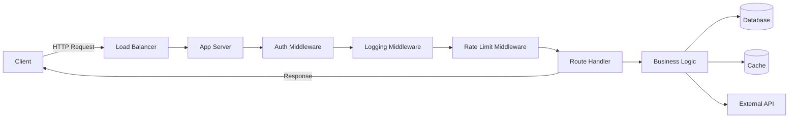

The backend is everything that runs on the server: request handling, business logic, data persistence, authentication, and integration with external services. Its job is to accept requests, process them securely and reliably, and return responses — while managing state that cannot live in the browser.

## Core responsibilities

| Responsibility | Examples |
|---|---|
| Routing | Map `GET /users/:id` to a handler |
| Serialisation | Parse JSON body, serialize response |
| Authentication | Verify JWT, check session |
| Authorisation | RBAC, ownership checks |
| Business logic | Pricing rules, workflow orchestration |
| Data access | Query DB, call external APIs |
| Caching | Redis for hot data |
| Background jobs | Email sending, report generation |
| Observability | Logging, metrics, tracing |
| Error handling | Structured errors, retry logic |

## Request lifecycle



## Middleware pattern

Middleware is a function in the request/response pipeline. Each middleware calls `next()` to pass control to the following middleware.

```javascript
// Express.js example
app.use(cors());                    // CORS headers
app.use(express.json());           // Parse JSON bodies
app.use(helmet());                 // Security headers
app.use(requestLogger);            // Log all requests
app.use('/api', authMiddleware);   // Auth for /api routes
app.use(rateLimiter);              // Rate limiting

app.get('/users/:id', async (req, res) => {
    const user = await userService.findById(req.params.id);
    if (!user) return res.status(404).json({ error: 'Not found' });
    res.json(user);
});

app.use(errorHandler);  // Must be last
```

## Common backend frameworks

| Language | Framework | Style |
|---|---|---|
| Node.js | Express, Fastify, Hono | Minimal, middleware |
| Node.js | NestJS | Opinionated, Angular-like |
| Python | FastAPI | Async, OpenAPI auto-gen |
| Python | Django | Batteries-included |
| Java | Spring Boot | Enterprise, DI |
| C# | ASP.NET Core | Full-featured, high performance |
| Go | Gin, Fiber, Chi | Minimal, fast |
| Ruby | Rails | Convention over configuration |
| Rust | Axum, Actix | High performance |

## Stateless vs stateful services

**Stateless** — no session state on the server. Every request carries all needed context (JWT token, request parameters). Can be scaled horizontally by adding instances.

**Stateful** — server holds session state. Requires sticky sessions (same client → same server) or shared session store (Redis). Harder to scale.

Modern APIs prefer stateless design. Put shared state in a database or cache that all instances can reach.

## Synchronous vs asynchronous request handling

### Blocking I/O (synchronous)

Thread waits idle while waiting for DB or external API. Java/Spring traditionally used this model — one thread per request. High concurrency needs many threads → high memory.

### Non-blocking I/O (asynchronous)

Thread is released while waiting. When I/O completes, a callback/continuation runs. Node.js and Go use this model. A single-threaded Node process can handle thousands of concurrent connections.

```javascript
// Node.js non-blocking
app.get('/users', async (req, res) => {
    const users = await db.query('SELECT * FROM users'); // non-blocking
    res.json(users);
    // thread free to handle other requests while awaiting DB
});
```

## Configuration management

Never hardcode configuration. Use environment variables:

```javascript
const config = {
    port:        parseInt(process.env.PORT ?? '3000'),
    dbUrl:       process.env.DATABASE_URL!,
    jwtSecret:   process.env.JWT_SECRET!,
    redisUrl:    process.env.REDIS_URL,
    logLevel:    process.env.LOG_LEVEL ?? 'info',
};
```

Validate at startup so misconfiguration fails fast:

```javascript
import { z } from 'zod';

const envSchema = z.object({
    DATABASE_URL: z.string().url(),
    JWT_SECRET:   z.string().min(32),
    PORT:         z.coerce.number().default(3000),
});

const env = envSchema.parse(process.env); // throws on invalid
```

## Structured logging

Logs should be machine-parseable in production:

```javascript
import pino from 'pino';
const logger = pino({ level: process.env.LOG_LEVEL ?? 'info' });

logger.info({ userId: req.user.id, action: 'login' }, 'User logged in');
logger.error({ err, requestId: req.id }, 'DB query failed');
```

Output: `{"time":1716300000,"level":30,"userId":"42","action":"login","msg":"User logged in"}`

Log aggregation tools (Loki, Datadog, Splunk) can filter, alert, and dashboard on structured fields.

## Graceful shutdown

```javascript
const server = app.listen(3000);

process.on('SIGTERM', async () => {
    logger.info('Shutting down...');
    server.close(() => {
        db.pool.end();          // close DB connections
        logger.info('Done');
        process.exit(0);
    });
    setTimeout(() => process.exit(1), 10_000); // force exit after 10s
});
```

Graceful shutdown: stop accepting new connections, finish in-flight requests, release resources, exit cleanly. Required for zero-downtime deployments (Kubernetes rolling updates).
