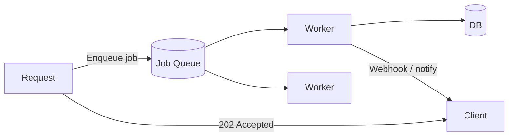

## Sessions and authentication state

### Cookie-based sessions

The server generates a session ID, stores session data server-side (Redis, DB), and sends the ID in a cookie. Every request looks up the session.

```mermaid
sequenceDiagram
    Client->>Server: POST /login {username, password}
    Server->>DB: Verify credentials
    DB-->>Server: OK
    Server->>Redis: SET session:abc123 {userId:42, roles:[...]} EX 3600
    Server-->>Client: 200 + Set-Cookie: sessionId=abc123; HttpOnly; Secure
    Client->>Server: GET /dashboard Cookie: sessionId=abc123
    Server->>Redis: GET session:abc123
    Redis-->>Server: {userId:42, roles:[admin]}
    Server-->>Client: Dashboard HTML
```

### JWT-based stateless auth

No server storage — the token is self-contained. Verified by signature. Cannot be revoked without a denylist.

```javascript
import jwt from 'jsonwebtoken';

// Issue token on login
const token = jwt.sign(
    { sub: user.id, roles: user.roles },
    process.env.JWT_SECRET,
    { expiresIn: '1h', algorithm: 'HS256' }
);

// Verify on each request
function authMiddleware(req, res, next) {
    const token = req.headers.authorization?.replace('Bearer ', '');
    try {
        req.user = jwt.verify(token, process.env.JWT_SECRET);
        next();
    } catch {
        res.status(401).json({ error: 'Unauthorized' });
    }
}
```

## Input validation and sanitisation

Never trust input. Validate at the boundary:

```javascript
import { z } from 'zod';

const createUserSchema = z.object({
    email:    z.string().email().max(255),
    password: z.string().min(8).max(72),
    age:      z.number().int().min(0).max(150).optional(),
    role:     z.enum(['user', 'admin']).default('user'),
});

app.post('/users', async (req, res) => {
    const result = createUserSchema.safeParse(req.body);
    if (!result.success) {
        return res.status(422).json({ errors: result.error.flatten() });
    }
    const user = await userService.create(result.data);
    res.status(201).json(user);
});
```

### Sanitisation vs validation

- **Validation**: reject invalid input (return 400/422)
- **Sanitisation**: clean input to prevent injection (e.g. HTML escaping, parameterised queries)

Use parameterised queries (not string interpolation) for all database operations:

```javascript
// BAD — SQL injection
const user = await db.query(`SELECT * FROM users WHERE id = ${req.params.id}`);

// GOOD — parameterised
const user = await db.query('SELECT * FROM users WHERE id = $1', [req.params.id]);
```

## Background jobs and queues

Long-running work (emails, PDF generation, video processing) should be done asynchronously:



### Job queue options

| Tool | Language | Features |
|---|---|---|
| BullMQ | Node.js (Redis) | Priorities, retries, rate limiting |
| Celery | Python (Redis/RabbitMQ) | Distributed, mature |
| Sidekiq | Ruby (Redis) | Simple, fast |
| Hangfire | C# | In-process, DB-backed |
| Temporal | Multi-language | Durable workflows, long-running |

### Job patterns

```javascript
import { Queue, Worker } from 'bullmq';

const emailQueue = new Queue('emails', { connection: redisConfig });

// Enqueue
await emailQueue.add('welcome', {
    to: 'user@example.com',
    template: 'welcome',
    userId: 42,
}, {
    attempts: 3,
    backoff: { type: 'exponential', delay: 1000 },
    removeOnComplete: 1000,
});

// Worker
new Worker('emails', async job => {
    await sendEmail(job.data);
}, { connection: redisConfig, concurrency: 5 });
```

## Rate limiting

Protect endpoints from abuse:

```javascript
import { rateLimit } from 'express-rate-limit';
import RedisStore from 'rate-limit-redis';

app.use('/api/auth', rateLimit({
    windowMs: 15 * 60 * 1000,  // 15 min
    max: 10,                    // 10 requests per window
    standardHeaders: true,
    legacyHeaders: false,
    store: new RedisStore({ client: redisClient }), // distributed across instances
    message: { error: 'Too many requests' },
}));
```

## Pagination

Never return unbounded lists:

```javascript
// Offset pagination — simple but O(n) for large offsets
app.get('/products', async (req, res) => {
    const page  = parseInt(req.query.page ?? '1');
    const limit = Math.min(parseInt(req.query.limit ?? '20'), 100);
    const offset = (page - 1) * limit;

    const [items, total] = await Promise.all([
        db.query('SELECT * FROM products ORDER BY id LIMIT $1 OFFSET $2', [limit, offset]),
        db.query('SELECT COUNT(*) FROM products'),
    ]);

    res.json({
        data: items.rows,
        pagination: { page, limit, total: parseInt(total.rows[0].count) },
    });
});

// Cursor pagination — O(1), handles inserts correctly
app.get('/products', async (req, res) => {
    const cursor = req.query.cursor;  // last seen id
    const limit  = 20;

    const query = cursor
        ? 'SELECT * FROM products WHERE id > $1 ORDER BY id LIMIT $2'
        : 'SELECT * FROM products ORDER BY id LIMIT $1';
    const params = cursor ? [cursor, limit] : [limit];

    const items = await db.query(query, params);
    const nextCursor = items.rows.at(-1)?.id;

    res.json({ data: items.rows, nextCursor });
});
```

## Error handling

Centralised error handling prevents information leakage and ensures consistent responses:

```javascript
class AppError extends Error {
    constructor(message, statusCode, code) {
        super(message);
        this.statusCode = statusCode;
        this.code = code;
        this.isOperational = true;
    }
}

// Global error handler (Express)
app.use((err, req, res, next) => {
    const requestId = req.headers['x-request-id'];

    if (err.isOperational) {
        return res.status(err.statusCode).json({
            error: { code: err.code, message: err.message },
            requestId,
        });
    }

    // Unexpected error — log full details, hide from client
    logger.error({ err, requestId }, 'Unexpected error');
    res.status(500).json({
        error: { code: 'INTERNAL_ERROR', message: 'An unexpected error occurred' },
        requestId,
    });
});
```

## Health checks

Every service should expose a `/health` endpoint for load balancers and orchestrators:

```javascript
app.get('/health', async (req, res) => {
    const checks = await Promise.allSettled([
        db.query('SELECT 1'),
        redisClient.ping(),
    ]);

    const status = checks.every(c => c.status === 'fulfilled') ? 'ok' : 'degraded';
    const code   = status === 'ok' ? 200 : 503;

    res.status(code).json({
        status,
        checks: {
            database: checks[0].status,
            cache:    checks[1].status,
        },
        uptime: process.uptime(),
    });
});
```
