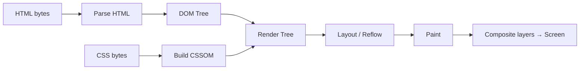
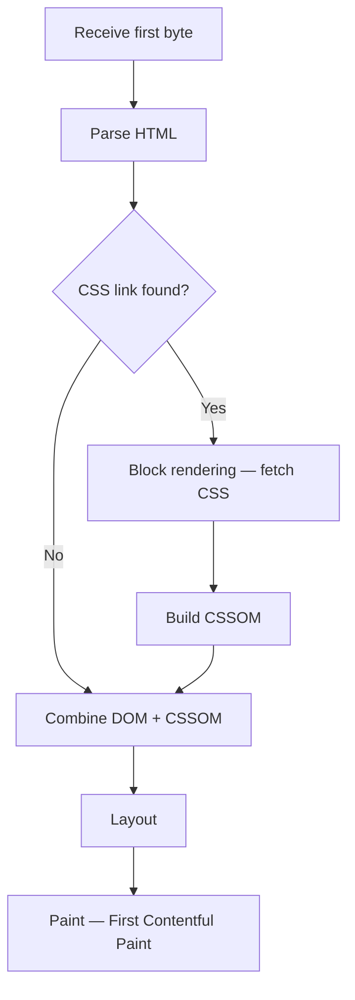

Understanding the rendering pipeline lets you reason about performance bottlenecks, layout thrash, paint jank, and why certain optimisations work.

## Pipeline overview



Each stage has different costs and different triggers for recalculation.

## Stage 1: Parsing

### HTML parsing

The HTML parser is **fault-tolerant** and incremental — it processes bytes as they arrive over the network. It builds the **DOM** (Document Object Model): a tree of nodes.

```html
<html>
  <body>
    <h1>Hello</h1>
    <p>World</p>
  </body>
</html>
```

Becomes:
```
Document
└── html
    └── body
        ├── h1 "Hello"
        └── p  "World"
```

### Parser-blocking resources

`<script>` tags without `async` or `defer` **block HTML parsing** — the browser must download, parse, and execute the script before continuing.

```html
<!-- Blocks parsing — BAD for above-the-fold content -->
<script src="app.js"></script>

<!-- Fetches in parallel, executes after DOM is ready -->
<script src="app.js" defer></script>

<!-- Fetches in parallel, executes immediately when ready -->
<script src="analytics.js" async></script>

<!-- Module scripts are deferred by default -->
<script type="module" src="app.js"></script>
```

### CSS parsing and render-blocking

CSS is **render-blocking** — the browser won't paint anything until all stylesheets are downloaded and the CSSOM is built. This prevents a flash of unstyled content (FOUC).

## Stage 2: Style calculation

The browser matches CSS rules to DOM nodes and computes **computed styles** for every visible element. Selector specificity and cascade order determine the final value for each property.

## Stage 3: Layout (Reflow)

Layout calculates the **position and size** of every box. It's an O(n) operation for most changes but can cascade — changing a parent's width can reflow all descendants.

### What triggers a full layout

- Adding/removing DOM nodes
- Changing `width`, `height`, `padding`, `margin`, `border`, `font-size`, `top`, `left`
- Reading layout properties after a DOM mutation (causes forced synchronous layout)

### Layout thrash (forced synchronous layout)

```javascript
// BAD — reads layout after write, forces synchronous layout
for (const el of elements) {
    el.style.width = el.offsetWidth + 10 + 'px'; // read → write → read → write
}

// GOOD — batch reads then writes
const widths = elements.map(el => el.offsetWidth); // all reads
elements.forEach((el, i) => el.style.width = widths[i] + 10 + 'px'); // all writes
```

## Stage 4: Paint

Paint records **draw calls** for each visual layer: backgrounds, borders, text, images, shadows. These are GPU commands, not pixels yet.

### What triggers repaint

- `color`, `background-color`, `border-color`, `box-shadow`, `outline`
- Opacity changes (if not on its own compositor layer)

### Composite-only properties (cheap)

Some properties skip layout and paint entirely — they're handled by the GPU compositor:

| Property | Notes |
|---|---|
| `transform` | Translate, scale, rotate, skew |
| `opacity` | Only if element has its own layer |
| `filter` | GPU-accelerated filters |
| `will-change` | Promotes to layer in advance |

**Prefer `transform: translateX(100px)` over `left: 100px`** for animations. The former is compositor-only; the latter triggers layout.

## Stage 5: Compositing

The browser rasterizes layers into bitmaps and sends them to the GPU. The GPU assembles the final frame. Layers are created for:

- Elements with `will-change: transform`
- `<video>`, `<canvas>`, `<iframe>`
- Elements with CSS 3D transforms
- Elements with `position: fixed`

Too many layers → high GPU memory usage. Don't promote everything.

## Critical Rendering Path (CRP)

The CRP is the sequence of steps from receiving bytes to painting the first pixel.



### CRP optimisation checklist

- Inline critical CSS for above-the-fold content
- Defer non-critical CSS with `media="print"` + JS flip trick or `<link rel="preload">`
- Defer or async JavaScript
- Preload key resources: `<link rel="preload" as="font" href="...">`
- Preconnect to third-party origins: `<link rel="preconnect" href="https://fonts.gstatic.com">`
- Compress and minify HTML, CSS, JS
- Serve critical resources from the same origin (avoid extra DNS/TCP)

## Frame rendering (animations)

The browser targets **60 fps = 16.7 ms per frame**. The frame budget:

```
16.7 ms total
├── JS execution           ~4 ms
├── Style recalculation    ~1 ms
├── Layout                 ~2 ms
├── Paint                  ~2 ms
└── Composite              ~2 ms
```

Long tasks (>50 ms on the main thread) block rendering and cause janky animations. Move heavy work to Web Workers or schedule with `requestIdleCallback`.

## requestAnimationFrame

Use `requestAnimationFrame` for visual updates — it synchronises with the browser's paint cycle:

```javascript
function animate() {
    element.style.transform = `translateX(${x++}px)`;
    requestAnimationFrame(animate);
}
requestAnimationFrame(animate);
```

Never use `setInterval` for animations — it's not tied to the paint cycle and will cause drift and dropped frames.
