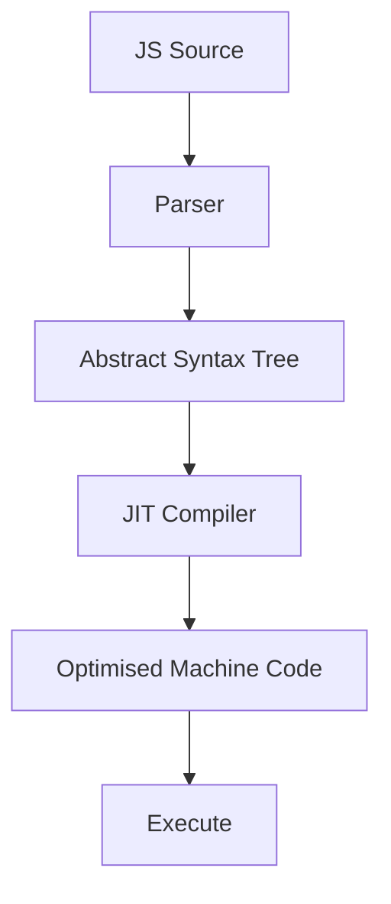
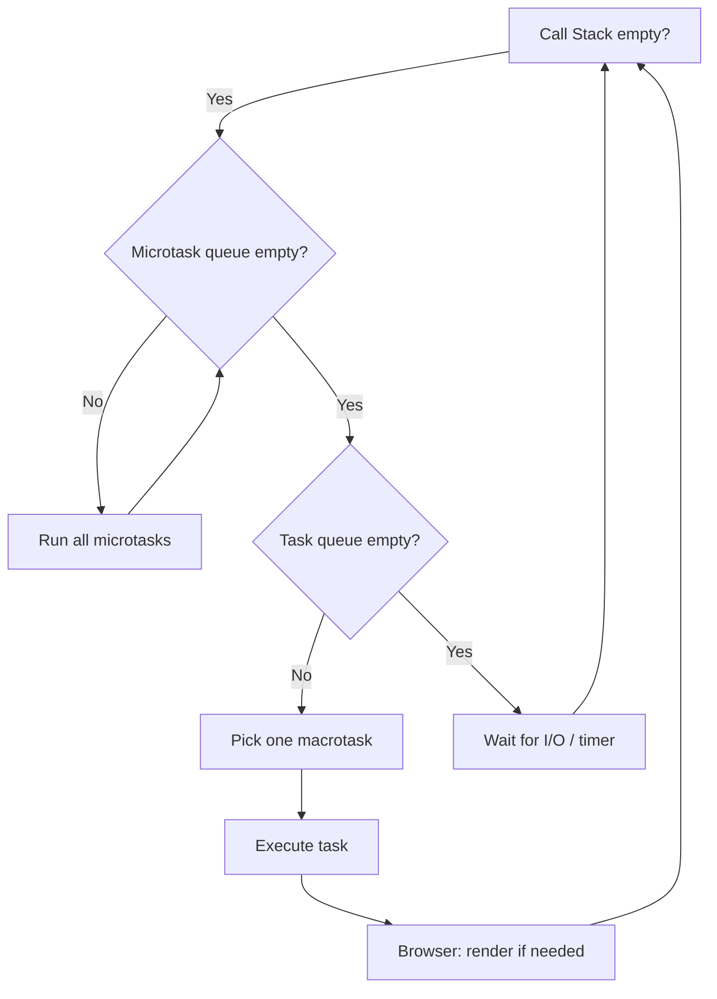
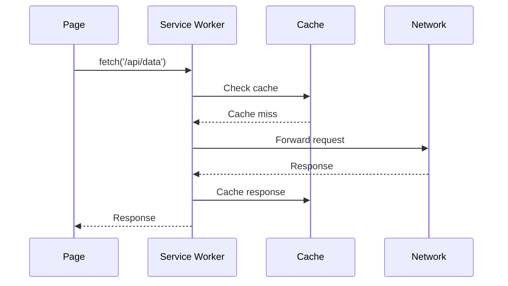

JavaScript is single-threaded with an event-driven concurrency model. Understanding the runtime prevents you from accidentally blocking the UI thread and explains why `async/await` works the way it does.

## The JavaScript engine



V8 (Node.js, Chrome) uses **Ignition** (interpreter) + **TurboFan** (optimising compiler). Hot code paths are recompiled to machine code with type assumptions. Deoptimisation happens when those assumptions break.

## Memory model

```
┌─────────────────────────────┐
│  Call Stack                 │  function calls + local vars
│  (fixed size ~1MB)          │
├─────────────────────────────┤
│  Heap                       │  objects, closures, arrays
│  (garbage collected)        │
├─────────────────────────────┤
│  Event Queue / Task Queue   │  setTimeout, I/O callbacks
├─────────────────────────────┤
│  Microtask Queue            │  Promise callbacks, queueMicrotask
└─────────────────────────────┘
```

## The Event Loop



### Macrotasks (Task Queue)

One task is processed per event loop iteration:

- `setTimeout(fn, delay)` — min ~4 ms
- `setInterval(fn, delay)`
- I/O callbacks
- `MessageChannel`
- User events (click, input)

### Microtasks (Microtask Queue)

**All** microtasks are drained before the next macrotask or render:

- `Promise.then` / `Promise.catch` / `Promise.finally`
- `queueMicrotask(fn)`
- `MutationObserver` callbacks
- `async/await` continuations

```javascript
console.log('1');

setTimeout(() => console.log('4 — macrotask'), 0);

Promise.resolve().then(() => console.log('3 — microtask'));

console.log('2');

// Output: 1, 2, 3, 4
```

## Call stack and stack overflow

Every function call pushes a frame onto the call stack. The frame stores:
- Local variables
- Arguments
- Return address

Stack overflow = too many nested calls (deep recursion without tail-call optimisation).

## Closures

A closure captures references to variables from its outer lexical scope:

```javascript
function counter() {
    let count = 0;
    return {
        increment: () => ++count,
        get: () => count,
    };
}
const c = counter();
c.increment(); // 1
c.increment(); // 2
c.get();       // 2
```

`count` lives in the heap because the returned functions hold a reference to it.

## Promises

A Promise represents an eventual value (pending → fulfilled | rejected).

```javascript
fetch('/api/data')
    .then(res => res.json())
    .then(data => console.log(data))
    .catch(err => console.error(err))
    .finally(() => setLoading(false));
```

### Promise combinators

| Combinator | Resolves when | Rejects when |
|---|---|---|
| `Promise.all([...])` | All resolve | Any rejects |
| `Promise.allSettled([...])` | All settle (any state) | Never |
| `Promise.race([...])` | First settles | First settles with rejection |
| `Promise.any([...])` | First resolves | All reject |

## async / await

`async/await` is syntactic sugar over Promises. An `async` function always returns a Promise. `await` suspends the function and releases the call stack (non-blocking).

```javascript
async function loadUser(id) {
    try {
        const res = await fetch(`/api/users/${id}`);
        if (!res.ok) throw new Error(`HTTP ${res.status}`);
        return await res.json();
    } catch (err) {
        console.error('Failed to load user', err);
        throw err;
    }
}
```

**Parallel execution:**

```javascript
// Sequential — each awaits the previous (slow)
const a = await fetchA();
const b = await fetchB();

// Parallel — both start immediately (fast)
const [a, b] = await Promise.all([fetchA(), fetchB()]);
```

## Web Workers

Web Workers run JS on a **separate thread**, communicating via message passing. They cannot access the DOM.

```javascript
// main.js
const worker = new Worker('worker.js');
worker.postMessage({ data: largeArray });
worker.onmessage = e => console.log('Result:', e.data);

// worker.js
self.onmessage = e => {
    const result = heavyComputation(e.data.data);
    self.postMessage(result);
};
```

### Worker types

| Type | Scope | Use case |
|---|---|---|
| Web Worker | Per page | CPU-intensive tasks |
| Service Worker | Background, per origin | Offline caching, push notifications |
| Shared Worker | Shared across tabs | Cross-tab communication |

## Service Workers and offline



Service workers intercept network requests and can serve cached responses, enabling offline-capable apps. Used by PWAs (Progressive Web Apps).

## Garbage collection

The V8 garbage collector (Orinoco) uses **generational GC**:

- **Young generation (Scavenger)**: New objects. Short-lived objects collected quickly.
- **Old generation (Mark-Compact)**: Survived GC cycles. Runs less frequently.

**Memory leaks** in JS:
- Global variables / accidental globals
- Forgotten event listeners
- Closures holding large objects
- Detached DOM nodes referenced by JS

Use Chrome DevTools Memory tab to take heap snapshots and find leaks.
