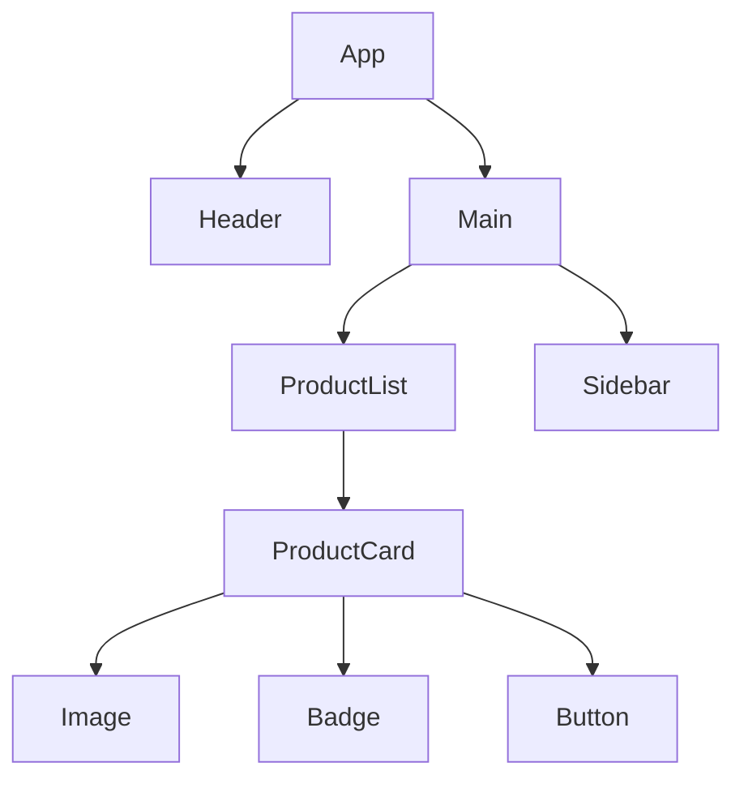
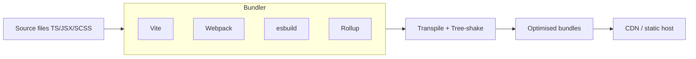

---
title: "Frontend Overview"
description: "The frontend landscape — browser, HTML, CSS, JavaScript, frameworks, tooling, and the component model."
---

import { Tabs, TabItem } from '@astrojs/starlight/components';
import { Aside, Card, CardGrid, Steps, Badge } from '@astrojs/starlight/components';

The frontend is everything that runs inside the user's browser. Its job is to render a useful interface, respond to user interactions, and communicate with backend services — all within a tightly constrained, heterogeneous execution environment you do not control.

## The browser as a platform

The browser provides:
- **HTML parser** → DOM (Document Object Model)
- **CSS engine** → CSSOM + layout
- **JavaScript engine** (V8, SpiderMonkey, JavaScriptCore)
- **Networking** (fetch, XHR, WebSocket, WebRTC)
- **Storage** (localStorage, sessionStorage, IndexedDB, cookies)
- **Graphics** (Canvas 2D, WebGL, WebGPU)
- **Workers** (Web Workers, Service Workers, Shared Workers)

## The three languages of the web

| Language | Role | Compiled? |
|---|---|---|
| HTML | Structure / semantics | No (markup) |
| CSS | Presentation / layout | No (declarative) |
| JavaScript | Behaviour / logic | JIT-compiled |

TypeScript transpiles to JavaScript. Sass/Less compile to CSS. WASM (WebAssembly) runs near-native binary code alongside JS.

## Component model

Modern frontends are built from **components** — self-contained units of HTML, CSS, and JS. Frameworks enforce this boundary differently:

### Major frameworks

| Framework | Model | Language | Rendering |
|---|---|---|---|
| React | Component tree, unidirectional data flow | JSX (JS/TS) | Virtual DOM |
| Vue | Options / Composition API, reactivity | Templates + JS | Virtual DOM |
| Angular | Opinionated full framework, DI | TypeScript | Incremental DOM |
| Svelte | Compile-time components, no VDOM | Svelte templates | Direct DOM |
| SolidJS | Fine-grained reactivity | JSX | Direct DOM |

## Rendering strategies

| Strategy | When HTML is generated | Use case |
|---|---|---|
| **CSR** (Client-Side Rendering) | In browser via JS | SPA dashboards, admin UIs |
| **SSR** (Server-Side Rendering) | On server per request | SEO, dynamic content |
| **SSG** (Static Site Generation) | At build time | Blogs, docs, marketing |
| **ISR** (Incremental Static Regen) | Build + background revalidation | E-commerce, news |
| **Streaming SSR** | Server streams HTML chunks | LCP improvement |
| **Islands Architecture** | Static HTML + hydrated interactive islands | Astro, Marko |

## State management

State lives at different scopes:

| Scope | Examples | Tools |
|---|---|---|
| Component-local | Form input, open/closed toggle | `useState`, `ref` |
| Shared across components | User session, shopping cart | Context, Zustand, Pinia |
| Server state (cache) | API responses, pagination | TanStack Query, SWR |
| URL state | Filters, page, search params | Router (React Router, Nuxt) |
| Persistent client state | Preferences, drafts | localStorage, IndexedDB |

## Build tooling

**Vite** is now the de-facto standard for new projects — uses esbuild for dev (native speed) and Rollup for prod.

### Key optimisations the build pipeline handles

- **Tree shaking** — remove unused exports
- **Code splitting** — lazy-load routes/components
- **Minification** — remove whitespace, shorten names
- **Asset hashing** — `main.a3f1b2.js` for immutable cache headers
- **Image optimisation** — WebP/AVIF conversion, responsive srcset

## Accessibility (a11y)

Accessibility is not optional — it's a legal requirement in many jurisdictions and makes products better for everyone.

Key principles:
- Use semantic HTML (`<button>`, `<nav>`, `<main>`, `<header>`)
- All interactive elements keyboard-focusable
- Sufficient colour contrast (WCAG 2.1 AA: 4.5:1 for text)
- ARIA attributes only when semantic HTML is insufficient
- Test with a screen reader (NVDA, VoiceOver)
