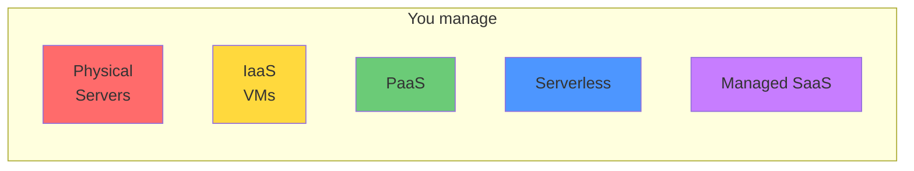

Cloud hosting means renting compute resources from a provider rather than managing physical hardware. The key question is how much of the stack you manage vs. the provider manages.

## Hosting models



| Model | You manage | Provider manages | Examples |
|---|---|---|---|
| **IaaS** | OS, runtime, app, data | Hardware, hypervisor | AWS EC2, Azure VMs, GCP Compute |
| **PaaS** | App code, data | OS, runtime, scaling | Heroku, Render, Railway, Fly.io |
| **CaaS** | Containers | Scheduling, infra | AWS ECS, Google Cloud Run |
| **Serverless** | Functions | Everything else | AWS Lambda, Cloudflare Workers |
| **Managed SaaS** | Configuration | Everything | Vercel, Netlify, Supabase |

## IaaS — Virtual Machines

EC2, GCP Compute, Azure VMs. You get a virtual machine; you configure everything inside it.

**Best for:** Maximum control, complex setups, high-traffic services with predictable load.

**Trade-offs:** Full operational burden — OS patching, security, scaling logic.

### Common setup

```
Internet → Load Balancer → Auto Scaling Group of EC2 instances
                               ↓
                         RDS (managed DB)
                         ElastiCache (managed Redis)
```

## PaaS — Platform as a Service

You push code (or a container); the platform handles deployment, scaling, TLS, domains.

### Render example

```yaml
# render.yaml
services:
  - type: web
    name: my-api
    env: node
    buildCommand: npm ci && npm run build
    startCommand: node dist/server.js
    healthCheckPath: /health
    envVars:
      - key: DATABASE_URL
        fromDatabase:
          name: my-db
          property: connectionString
    autoDeploy: true

databases:
  - name: my-db
    databaseName: myapp
    plan: starter
```

### Platform comparison

| Platform | Strength | Free tier | Region lock |
|---|---|---|---|
| Render | Simple, Docker support | Yes | No |
| Railway | Dev-friendly, fast deploys | Yes | No |
| Fly.io | Global edge, Docker, low latency | Yes | No |
| Heroku | Mature, add-ons ecosystem | No | No |
| AWS Elastic Beanstalk | AWS integration | No | No |

## Serverless — Functions as a Service

Upload a function; it runs on demand. No servers to manage, infinite scale, pay per invocation.

```javascript
// AWS Lambda (Node.js)
export const handler = async (event) => {
    const body = JSON.parse(event.body);
    const result = await processOrder(body);
    return {
        statusCode: 200,
        headers: { 'Content-Type': 'application/json' },
        body: JSON.stringify(result),
    };
};
```

### Cold starts

Serverless functions have **cold starts** — the first invocation after the function has been idle takes longer (100 ms–3 s depending on runtime and package size).

| Runtime | Typical cold start |
|---|---|
| Cloudflare Workers (V8 isolates) | < 5 ms |
| AWS Lambda (Python, Node.js) | 100–500 ms |
| AWS Lambda (Java, .NET) | 1–3 s |

Mitigation: provisioned concurrency (keep N instances warm), reduce package size, use edge runtimes.

### When serverless fits and when it doesn't

**Fits:**
- Event-driven tasks (image processing on upload)
- Infrequent background jobs
- Variable traffic with long idle periods
- Edge personalisation

**Doesn't fit:**
- Long-running operations (> 15 min limit on Lambda)
- WebSocket servers
- High-throughput APIs that need consistent low latency
- Services with heavy in-memory state

## Edge computing

Run code at CDN PoPs close to users rather than in a central region:

| Platform | Runtime | Use case |
|---|---|---|
| Cloudflare Workers | V8 isolates | Ultra-low latency logic |
| Vercel Edge Functions | V8 isolates | Next.js middleware |
| Fastly Compute | Wasm | Custom CDN logic |
| AWS Lambda@Edge | Node.js | CloudFront customisation |

## CDNs — Content Delivery Networks

A CDN is a globally distributed cache that serves static assets from the PoP (Point of Presence) closest to the user.


**Cache-hit ratio** is the key metric. For immutable assets (hashed filenames) it should be ~100%.

### Major CDNs

| CDN | Compute offering | PoPs |
|---|---|---|
| Cloudflare | Workers | 300+ |
| AWS CloudFront | Lambda@Edge | 450+ |
| Fastly | Compute@Edge | 100+ |
| Azure CDN | — | 190+ |
| Vercel | Edge Functions | 100+ |

### CDN configuration for SPAs

```
/index.html           Cache-Control: no-cache
/assets/main.a3f1.js  Cache-Control: max-age=31536000, immutable
/assets/logo.svg      Cache-Control: max-age=31536000, immutable
```

## Static site hosting

Static sites (built by Astro, Next.js SSG, Hugo, etc.) can be served directly from object storage + CDN:

| Platform | Free tier | Global CDN | Build integration |
|---|---|---|---|
| Vercel | Generous | Yes | Native Next.js |
| Netlify | Generous | Yes | Any static site |
| Cloudflare Pages | Unlimited bandwidth | Yes | Any static site |
| GitHub Pages | Yes | CDN (limited) | GitHub Actions |
| AWS S3 + CloudFront | Pay as you go | Yes | Manual |

## Cost model comparison

| Model | Cost pattern | Risk |
|---|---|---|
| VMs | Fixed hourly | Pay for idle capacity |
| PaaS | Fixed/per dyno | Pay for reserved slots |
| Serverless | Pay per invocation | Surprise bills at high traffic |
| CDN | Pay per GB | Low — bandwidth is cheap |

Always set billing alerts. Serverless and traffic-based pricing can spike unexpectedly (DDoS, viral traffic).
