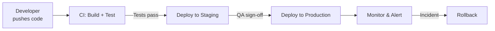
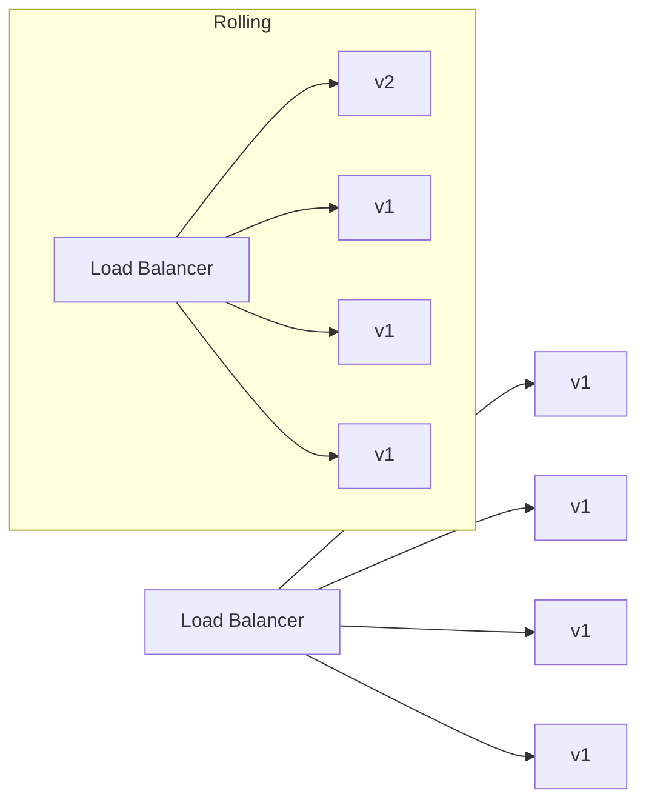

Deploying an application means making code changes available to users reliably and without downtime. Modern deployment is automated, reproducible, and incremental — not SSH-ing into a server and running `git pull`.

## The deployment pipeline



## Environments

| Environment | Purpose | Who uses it |
|---|---|---|
| **Local** | Development | Individual developer |
| **CI** | Automated testing | CI runner |
| **Dev/Preview** | Feature branch previews | Team review |
| **Staging** | Production mirror, integration testing | QA, product |
| **Production** | Live user traffic | End users |

Configuration (API keys, DB URLs) differs per environment. Store it in environment variables or a secrets manager, never in code.

## Build artefacts

Before deploying, the app is built into an artefact:

| App type | Artefact |
|---|---|
| Static frontend | Directory of HTML/CSS/JS files |
| Node.js service | Node modules + JS bundle |
| JVM service | `.jar` or `.war` file |
| Go / Rust | Single binary |
| Container | Docker image (OCI format) |

A Docker image is the most portable artefact — it includes the runtime, OS libraries, and app code. Build once, run anywhere.

## Deployment strategies

### Big Bang (replace)

Stop old version, start new version. Causes downtime — not acceptable for production.

### Rolling deployment

Replace instances one at a time while traffic continues:



Kubernetes does this by default with `RollingUpdate` strategy.

### Blue/Green deployment

Run two identical environments. Switch traffic instantly. Immediate rollback by switching back.

```
LB → Blue (v1, live)     Green (v2, idle — ready)
         ↕ switch traffic
LB → Green (v2, live)    Blue (v1, idle — fallback)
```

Cost: double infrastructure during deployment. Used when you need instant cutover.

### Canary deployment

Route a small percentage of traffic to the new version first:

```
LB → 95% → v1 instances
   →  5% → v2 instances   ← monitor error rate, latency
```

If metrics are healthy, gradually shift traffic to 100% v2. If errors spike, roll back the 5% immediately with no impact to most users.

### Feature flags

Deploy code dark (off by default), enable it progressively without re-deploying:

```javascript
if (featureFlags.isEnabled('new-checkout', user.id)) {
    return newCheckoutFlow();
}
return legacyCheckoutFlow();
```

Tools: LaunchDarkly, Unleash, Growthbook, Flagsmith.

## Infrastructure as Code (IaC)

Infrastructure should be defined in code, reviewed, versioned, and applied via pipeline — not clicked in a cloud console.

```hcl
# Terraform — provision a server
resource "aws_instance" "web" {
    ami           = "ami-0c55b159cbfafe1f0"
    instance_type = "t3.micro"
    tags          = { Name = "web-server" }
}

resource "aws_lb_target_group_attachment" "web" {
    target_group_arn = aws_lb_target_group.main.arn
    target_id        = aws_instance.web.id
}
```

## Zero-downtime deployment checklist

- [ ] Multiple instances behind a load balancer
- [ ] Health check endpoint (`/health`) that returns 200 only when ready
- [ ] Rolling update strategy in orchestrator (Kubernetes, ECS)
- [ ] Readiness probe — LB stops sending traffic to unhealthy instances
- [ ] Database migrations are backward-compatible (old code runs on new schema)
- [ ] Feature flags for risky code paths
- [ ] Automated rollback on error rate spike

## Database migration and deployment ordering

The hardest part of zero-downtime deployments is database migrations. The rule: **always expand before contract**.

```
Step 1: Migrate DB — add new column (nullable, with default)
Step 2: Deploy new code — writes to both old and new column
Step 3: Backfill old rows
Step 4: Deploy cleanup code — reads from new column only
Step 5: Migrate DB — drop old column
```

Never rename a column in one step — it will break old code still running.

## Rollback

Always have a rollback plan before deploying:

| Strategy | How | Speed |
|---|---|---|
| Re-deploy previous artefact | Re-run pipeline with old tag | 2–5 min |
| Blue/Green switch-back | Route LB back to blue | Seconds |
| Feature flag disable | Toggle flag off | Instant |
| Database rollback | Apply down migration | Risky — data loss |

Track deployments in a deployment log (Datadog, Grafana, internal) so you can correlate error spikes with deployments.
