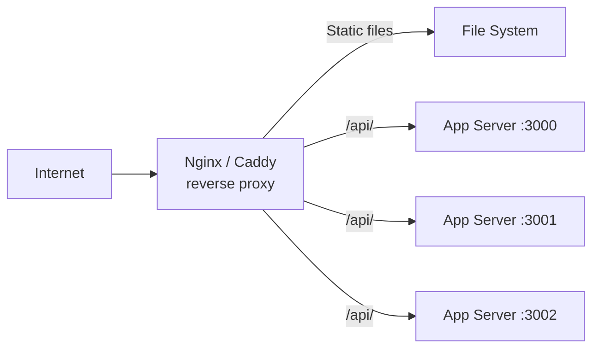

A web server is software that accepts HTTP requests and serves responses. In modern deployments it acts as a **reverse proxy** — the public-facing entry point that handles TLS, compression, caching headers, and forwards requests to application servers.

## Role in the stack



The web server handles:
- TLS termination (decrypt once, pass HTTP internally)
- Static asset serving (fast, no app code involved)
- Gzip/Brotli compression
- Load balancing across app instances
- Rate limiting
- Request buffering (shield app from slow clients)
- Access logs

## Nginx

Nginx is the most widely deployed web server. Event-driven, non-blocking, extremely performant for static content and proxying.

### Basic configuration structure

```nginx
# /etc/nginx/nginx.conf
worker_processes auto;  # one per CPU core
events {
    worker_connections 1024;
}

http {
    include mime.types;
    sendfile on;
    tcp_nopush on;
    gzip on;
    gzip_types text/plain text/css application/javascript application/json;

    include /etc/nginx/conf.d/*.conf;
}
```

### HTTPS reverse proxy

```nginx
# /etc/nginx/conf.d/app.conf
server {
    listen 80;
    server_name example.com www.example.com;
    return 301 https://$host$request_uri;
}

server {
    listen 443 ssl http2;
    server_name example.com www.example.com;

    ssl_certificate     /etc/letsencrypt/live/example.com/fullchain.pem;
    ssl_certificate_key /etc/letsencrypt/live/example.com/privkey.pem;
    ssl_protocols TLSv1.2 TLSv1.3;
    ssl_prefer_server_ciphers off;

    add_header Strict-Transport-Security "max-age=63072000; includeSubDomains; preload" always;
    add_header X-Frame-Options DENY always;
    add_header X-Content-Type-Options nosniff always;

    # Static files
    location /assets/ {
        root /var/www/app;
        expires 1y;
        add_header Cache-Control "public, immutable";
    }

    # Proxy to app server
    location / {
        proxy_pass http://app_backend;
        proxy_set_header Host $host;
        proxy_set_header X-Real-IP $remote_addr;
        proxy_set_header X-Forwarded-For $proxy_add_x_forwarded_for;
        proxy_set_header X-Forwarded-Proto $scheme;
    }
}

upstream app_backend {
    least_conn;                        # load balancing strategy
    server 127.0.0.1:3000;
    server 127.0.0.1:3001;
    keepalive 32;                      # keep persistent connections
}
```

### Load balancing strategies

```nginx
upstream backend {
    # Round-robin (default) — equal distribution
    server 10.0.0.1:3000;
    server 10.0.0.2:3000;

    # Weighted — send more traffic to faster server
    server 10.0.0.1:3000 weight=3;
    server 10.0.0.2:3000 weight=1;

    # Least connections — best for variable request duration
    least_conn;

    # IP hash — same client always hits same server (session affinity)
    ip_hash;
}
```

### Rate limiting

```nginx
limit_req_zone $binary_remote_addr zone=api:10m rate=10r/s;

location /api/ {
    limit_req zone=api burst=20 nodelay;
    limit_req_status 429;
    proxy_pass http://app_backend;
}
```

## Apache HTTP Server

Apache uses a process/thread model (vs Nginx's event model). More flexible with `.htaccess` per-directory config. Common in shared hosting. Lower raw performance than Nginx for static content.

```apache
<VirtualHost *:443>
    ServerName example.com
    DocumentRoot /var/www/app

    SSLEngine on
    SSLCertificateFile /etc/ssl/certs/example.crt
    SSLCertificateKeyFile /etc/ssl/private/example.key

    ProxyPreserveHost On
    ProxyPass /api/ http://localhost:3000/api/
    ProxyPassReverse /api/ http://localhost:3000/api/

    <Directory /var/www/app/assets>
        ExpiresActive On
        ExpiresDefault "access plus 1 year"
        Header append Cache-Control "public, immutable"
    </Directory>
</VirtualHost>
```

## Caddy

Caddy's killer feature: **automatic HTTPS**. It obtains and renews Let's Encrypt certificates automatically with zero configuration.

```caddyfile
example.com {
    # TLS is automatic — no ssl_certificate config needed

    handle /assets/* {
        root * /var/www/app
        file_server
        header Cache-Control "public, max-age=31536000, immutable"
    }

    reverse_proxy /api/* localhost:3000

    reverse_proxy /* localhost:3000 {
        lb_policy least_conn
        to localhost:3000 localhost:3001 localhost:3002
    }

    encode gzip zstd

    header {
        Strict-Transport-Security "max-age=63072000; includeSubDomains; preload"
        X-Frame-Options DENY
        -Server  # hide server header
    }
}
```

## Comparison

| | Nginx | Apache | Caddy |
|---|---|---|---|
| Architecture | Event-driven | Process/thread | Event-driven (Go) |
| Performance | Excellent | Good | Very good |
| TLS auto-provisioning | No (certbot) | No (certbot) | Yes (built-in) |
| Config complexity | Medium | Medium/high | Low |
| `.htaccess` support | No | Yes | No |
| Modules / extensions | Limited, compiled | Dynamic | Plugin API |
| Memory use | Low | Higher | Low |
| Best for | Reverse proxy, static | Legacy, shared hosting | Simplicity, HTTPS |

## Serving Single Page Applications (SPA)

SPAs need all routes to serve `index.html` — the JS router handles the path:

```nginx
server {
    root /var/www/app;
    index index.html;

    location / {
        try_files $uri $uri/ /index.html;
    }

    location /api/ {
        proxy_pass http://app_backend;
    }
}
```

## Nginx as an API gateway

```nginx
server {
    # Route to different microservices by path prefix
    location /api/users/    { proxy_pass http://user-service:3001/; }
    location /api/products/ { proxy_pass http://product-service:3002/; }
    location /api/orders/   { proxy_pass http://order-service:3003/; }

    # Auth proxy pattern — check auth before forwarding
    location /api/ {
        auth_request /auth;
        proxy_pass http://backend;
    }
    location /auth {
        internal;
        proxy_pass http://auth-service/verify;
    }
}
```
