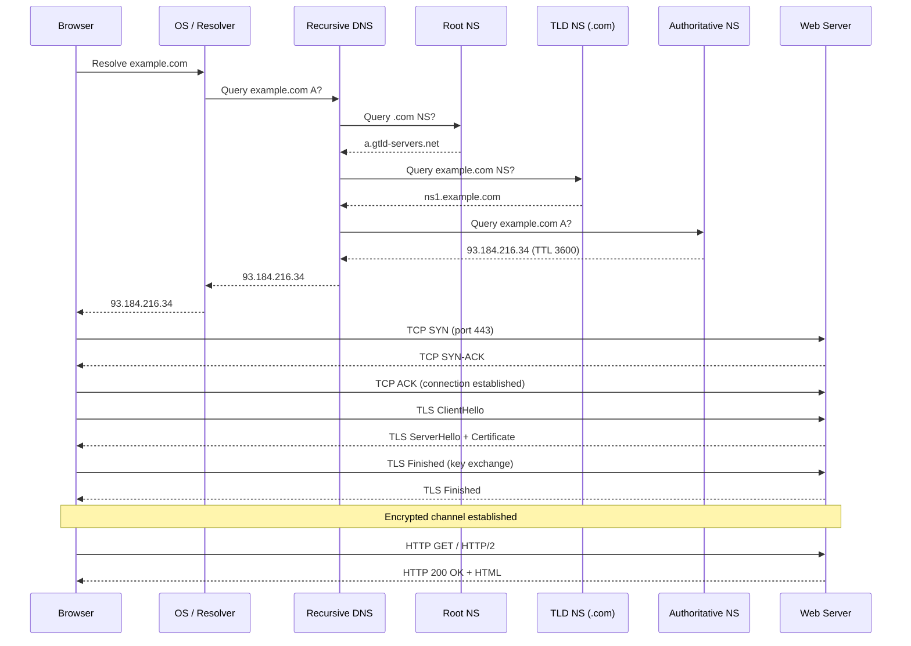

---
title: "How the Web Works"
description: "End-to-end journey of a browser request — DNS, TCP, TLS, HTTP, and back — explained for engineers."
---

import { Tabs, TabItem } from '@astrojs/starlight/components';
import { Aside, Card, CardGrid, Steps, Badge } from '@astrojs/starlight/components';


Every time you type a URL and press Enter, a precise sequence of network operations happens in under 200 ms. Understanding this sequence lets you debug performance problems, security issues, and infrastructure failures at their root.

## The full journey



## Step 1: URL parsing

The browser breaks `https://www.example.com:443/search?q=dns#results` into:

| Part | Value |
|---|---|
| Scheme | `https` |
| Host | `www.example.com` |
| Port | `443` (default for HTTPS, omitted) |
| Path | `/search` |
| Query string | `q=dns` |
| Fragment | `results` (never sent to server) |

## Step 2: DNS resolution

DNS resolution is a **recursive lookup** through a hierarchy. Results are cached at every level with a TTL.

### Cache order (fastest to slowest)

1. Browser DNS cache (chrome://net-internals/#dns)
2. OS DNS cache / `/etc/hosts`
3. Router / local DNS
4. ISP recursive resolver
5. Root → TLD → Authoritative name servers

### Record types you'll encounter

| Record | Purpose |
|---|---|
| `A` | IPv4 address |
| `AAAA` | IPv6 address |
| `CNAME` | Alias to another hostname |
| `MX` | Mail exchange |
| `TXT` | Arbitrary text (SPF, DKIM, ACME challenges) |
| `NS` | Authoritative name server |
| `SOA` | Start of authority — zone metadata |

### DNS over HTTPS (DoH) / DNS over TLS (DoT)

Traditional DNS is plaintext on UDP/53. DoH and DoT encrypt queries so ISPs and network observers cannot see which domains you resolve.

## Step 3: TCP connection

TCP provides a **reliable, ordered byte stream** between two endpoints.

### Three-way handshake

```
Client                    Server
  |------- SYN ----------->|   seq=x
  |<------ SYN-ACK --------|   seq=y, ack=x+1
  |------- ACK ----------->|   ack=y+1
  | (connection established)|
```

**Cost:** One round-trip before any data flows. This is why connection reuse (keep-alive, HTTP/2 multiplexing) matters.

### TCP vs UDP

| | TCP | UDP |
|---|---|---|
| Reliability | Guaranteed delivery & order | Best-effort |
| Speed | Slower (handshake, retransmits) | Faster |
| Use cases | HTTP, SSH, databases | DNS queries, video streaming, QUIC |

## Step 4: TLS handshake (HTTPS)

TLS adds encryption, authentication, and integrity on top of TCP.

### TLS 1.3 handshake (simplified)

```
Client                        Server
  |------ ClientHello -------->|  supported ciphers, random, key share
  |<----- ServerHello ---------|  chosen cipher, server key share, certificate
  |<----- {EncryptedExts} -----|
  |<----- {Certificate} -------|  X.509 cert chain
  |<----- {CertVerify} --------|  signature proving private key ownership
  |<----- {Finished} ----------|
  |------- {Finished} -------->|
  |   Application data flows   |
```

TLS 1.3 completes in **1 round-trip** (vs. 2 in TLS 1.2). With **0-RTT**, repeat connections can send data immediately (with replay caveats).

## Step 5: HTTP request & response

```http
GET /search?q=dns HTTP/2
Host: www.example.com
Accept: text/html,application/xhtml+xml
Accept-Encoding: gzip, br
Accept-Language: en-US
Cookie: session=abc123
```

```http
HTTP/2 200 OK
Content-Type: text/html; charset=utf-8
Content-Encoding: br
Cache-Control: max-age=3600
Strict-Transport-Security: max-age=31536000; includeSubDomains

<!DOCTYPE html>...
```

## Step 6: Browser rendering

Once the HTML arrives:

1. **Parse HTML** → DOM tree
2. **Parse CSS** → CSSOM tree
3. **Combine** → Render tree (only visible nodes)
4. **Layout** → Compute positions and sizes
5. **Paint** → Draw pixels to layers
6. **Composite** → GPU assembles layers into final frame

JavaScript execution can block parsing (unless `async`/`defer`). Critical rendering path optimisation is about minimising blocking work.

## Key performance metrics

| Metric | Meaning | Good target |
|---|---|---|
| TTFB | Time to first byte | < 200 ms |
| FCP | First contentful paint | < 1.8 s |
| LCP | Largest contentful paint | < 2.5 s |
| CLS | Cumulative layout shift | < 0.1 |
| INP | Interaction to next paint | < 200 ms |

## Common problems and root causes

| Symptom | Likely cause |
|---|---|
| Slow DNS | High TTL on old record, no DoH, resolver far away |
| TLS errors | Expired cert, wrong hostname, self-signed without trust anchor |
| High TTFB | Slow DB query, no caching, cold container start |
| 502 Bad Gateway | App server crashed or overloaded behind reverse proxy |
| Mixed content | HTTP resources on HTTPS page — blocked by browser |
