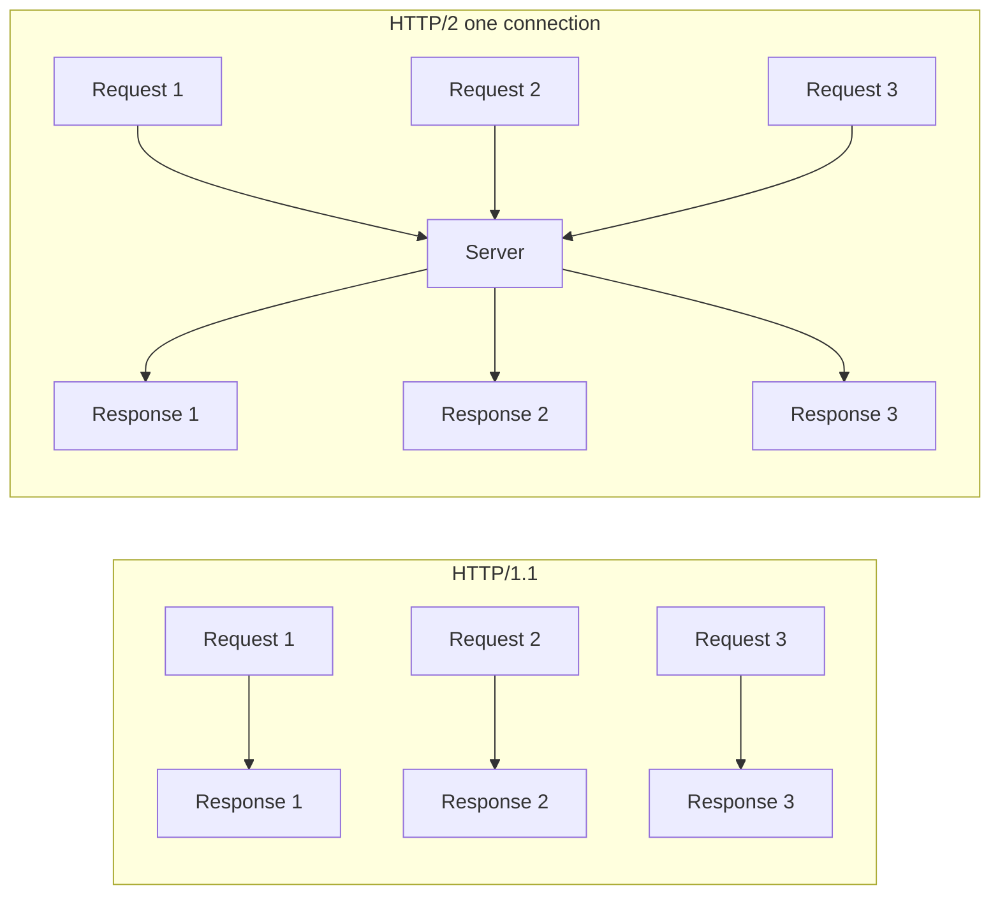
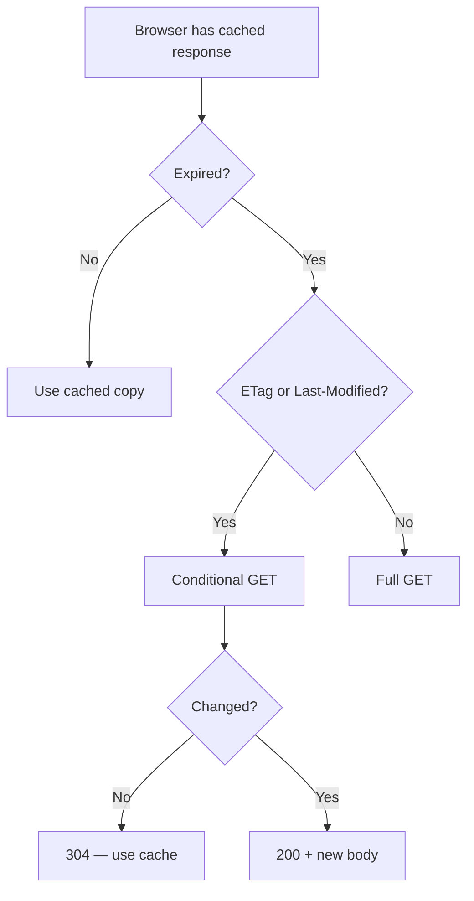

HTTP (HyperText Transfer Protocol) is the application-layer protocol that powers the web. Understanding it in depth is prerequisite knowledge for API design, debugging, caching, and security.

## HTTP versions at a glance

| Version | Transport | Key feature | Year |
|---|---|---|---|
| HTTP/1.0 | TCP | One request per connection | 1996 |
| HTTP/1.1 | TCP | Keep-alive, pipelining, chunked transfer | 1997 |
| HTTP/2 | TCP (TLS in practice) | Multiplexing, header compression, server push | 2015 |
| HTTP/3 | QUIC (UDP) | No head-of-line blocking, built-in TLS | 2022 |

### HTTP/2 multiplexing



### HTTP/3 and QUIC

QUIC runs over UDP and implements its own reliable stream layer. Benefits:
- No TCP head-of-line blocking (a lost packet only stalls its stream, not all streams)
- Faster connection setup (TLS 1.3 integrated — 0-RTT possible)
- Connection migration (works across network changes, e.g. WiFi → LTE)

## HTTP methods

| Method | Safe | Idempotent | Has body | Use |
|---|---|---|---|---|
| `GET` | Yes | Yes | No | Retrieve resource |
| `HEAD` | Yes | Yes | No | GET without body (check existence, caching) |
| `POST` | No | No | Yes | Create resource or submit action |
| `PUT` | No | Yes | Yes | Replace full resource |
| `PATCH` | No | No | Yes | Partial update |
| `DELETE` | No | Yes | No | Remove resource |
| `OPTIONS` | Yes | Yes | No | Preflight CORS, capability discovery |
| `CONNECT` | No | No | No | Establish tunnel (proxy) |
| `TRACE` | Yes | Yes | No | Echo request (diagnostic, usually disabled) |

**Safe** = read-only, no side effects.  
**Idempotent** = calling N times = calling once (safe to retry).

## Status codes

### 1xx — Informational

| Code | Meaning |
|---|---|
| 100 | Continue |
| 101 | Switching Protocols (upgrade to WebSocket) |

### 2xx — Success

| Code | Meaning |
|---|---|
| 200 | OK |
| 201 | Created (POST that created a resource) |
| 202 | Accepted (async — processing later) |
| 204 | No Content (DELETE, PUT with no body response) |
| 206 | Partial Content (range request) |

### 3xx — Redirection

| Code | Meaning | Caching |
|---|---|---|
| 301 | Moved Permanently | Cached forever |
| 302 | Found (temporary redirect) | Not cached |
| 303 | See Other (redirect after POST) | Not cached |
| 304 | Not Modified (conditional GET hit) | — |
| 307 | Temporary Redirect (same method) | Not cached |
| 308 | Permanent Redirect (same method) | Cached |

### 4xx — Client errors

| Code | Meaning |
|---|---|
| 400 | Bad Request (malformed syntax) |
| 401 | Unauthorized (authentication required) |
| 403 | Forbidden (authenticated but no permission) |
| 404 | Not Found |
| 405 | Method Not Allowed |
| 409 | Conflict (e.g. duplicate resource) |
| 410 | Gone (permanently removed) |
| 422 | Unprocessable Entity (validation error) |
| 429 | Too Many Requests (rate limited) |

### 5xx — Server errors

| Code | Meaning |
|---|---|
| 500 | Internal Server Error |
| 502 | Bad Gateway (upstream returned invalid response) |
| 503 | Service Unavailable (overloaded or down) |
| 504 | Gateway Timeout (upstream too slow) |

## Key headers

### Request headers

```http
GET /api/users/42 HTTP/2
Host: api.example.com
Authorization: Bearer eyJhbGci...
Accept: application/json
Accept-Encoding: gzip, br
Accept-Language: en-US
Content-Type: application/json
If-None-Match: "33a64df5"
If-Modified-Since: Wed, 21 Oct 2015 07:28:00 GMT
Cache-Control: no-cache
```

### Response headers

```http
HTTP/2 200 OK
Content-Type: application/json; charset=utf-8
Content-Encoding: gzip
Content-Length: 2048
Cache-Control: public, max-age=3600, stale-while-revalidate=86400
ETag: "33a64df5"
Last-Modified: Wed, 21 Oct 2015 07:28:00 GMT
Vary: Accept-Encoding
X-Request-ID: a1b2c3d4
Strict-Transport-Security: max-age=31536000; includeSubDomains; preload
X-Content-Type-Options: nosniff
X-Frame-Options: DENY
```

## HTTP caching

### Cache-Control directives

| Directive | Who | Meaning |
|---|---|---|
| `max-age=N` | Response | Fresh for N seconds |
| `s-maxage=N` | Response | CDN override of max-age |
| `no-cache` | Both | Must revalidate before using cached copy |
| `no-store` | Response | Never store (sensitive data) |
| `private` | Response | Browser only, not CDN |
| `public` | Response | CDN may cache |
| `stale-while-revalidate=N` | Response | Serve stale while fetching fresh in background |
| `immutable` | Response | Never revalidate (content-hashed assets) |

### Conditional requests

The browser stores the `ETag` or `Last-Modified` from a previous response and sends it back:

```
Browser:  GET /style.css   If-None-Match: "abc123"
Server:   304 Not Modified  (no body — browser uses cached copy)
```



## Cookies

```http
Set-Cookie: session=abc123; Path=/; HttpOnly; Secure; SameSite=Strict; Max-Age=3600
```

| Attribute | Purpose |
|---|---|
| `HttpOnly` | JS cannot read — prevents XSS token theft |
| `Secure` | HTTPS only |
| `SameSite=Strict` | Not sent cross-site — CSRF protection |
| `SameSite=Lax` | Sent on top-level navigation only |
| `SameSite=None; Secure` | Third-party cookies (requires Secure) |
| `Max-Age=N` | Lifetime in seconds |
| `Expires=date` | Absolute expiry |
| `Domain=.example.com` | Sent to all subdomains |
| `Path=/api` | Scoped to path prefix |

## Content negotiation

The client advertises preferences; the server picks the best match:

```http
Accept: text/html, application/xhtml+xml, application/xml;q=0.9, */*;q=0.8
Accept-Language: en-US,en;q=0.9,de;q=0.5
Accept-Encoding: gzip, deflate, br
```

`q` values (0–1) express preference weight.

## Transfer encoding and compression

| Encoding | Algorithm | Compression ratio | Notes |
|---|---|---|---|
| `gzip` | DEFLATE | ~70% for text | Universal support |
| `br` (Brotli) | LZ77 + Huffman | ~15% better than gzip | HTTPS only |
| `zstd` | Zstandard | Very high | Growing adoption |
| `chunked` | None | — | Stream response without Content-Length |

## CORS (Cross-Origin Resource Sharing)

```http
OPTIONS /api/data HTTP/2
Origin: https://app.example.com
Access-Control-Request-Method: POST
Access-Control-Request-Headers: Authorization

HTTP/2 204 No Content
Access-Control-Allow-Origin: https://app.example.com
Access-Control-Allow-Methods: GET, POST, DELETE
Access-Control-Allow-Headers: Authorization, Content-Type
Access-Control-Max-Age: 86400
```

CORS is a browser enforcement mechanism — servers and curl are unaffected. The Same-Origin Policy blocks cross-origin requests from JS; CORS is the opt-in exception.
