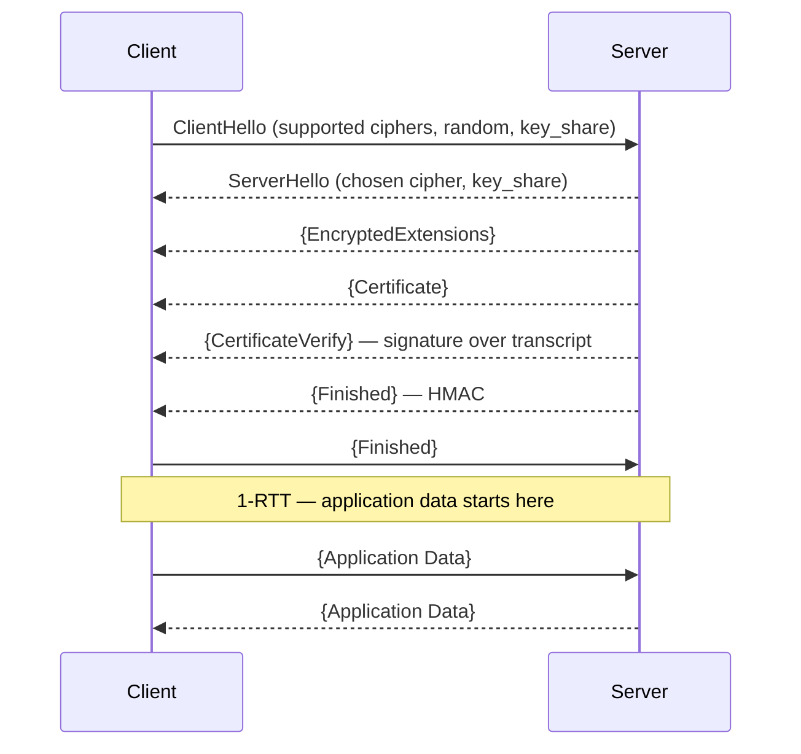
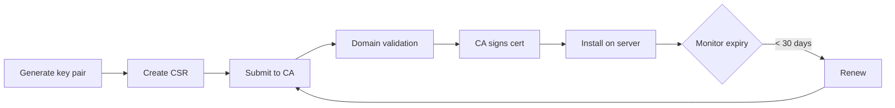
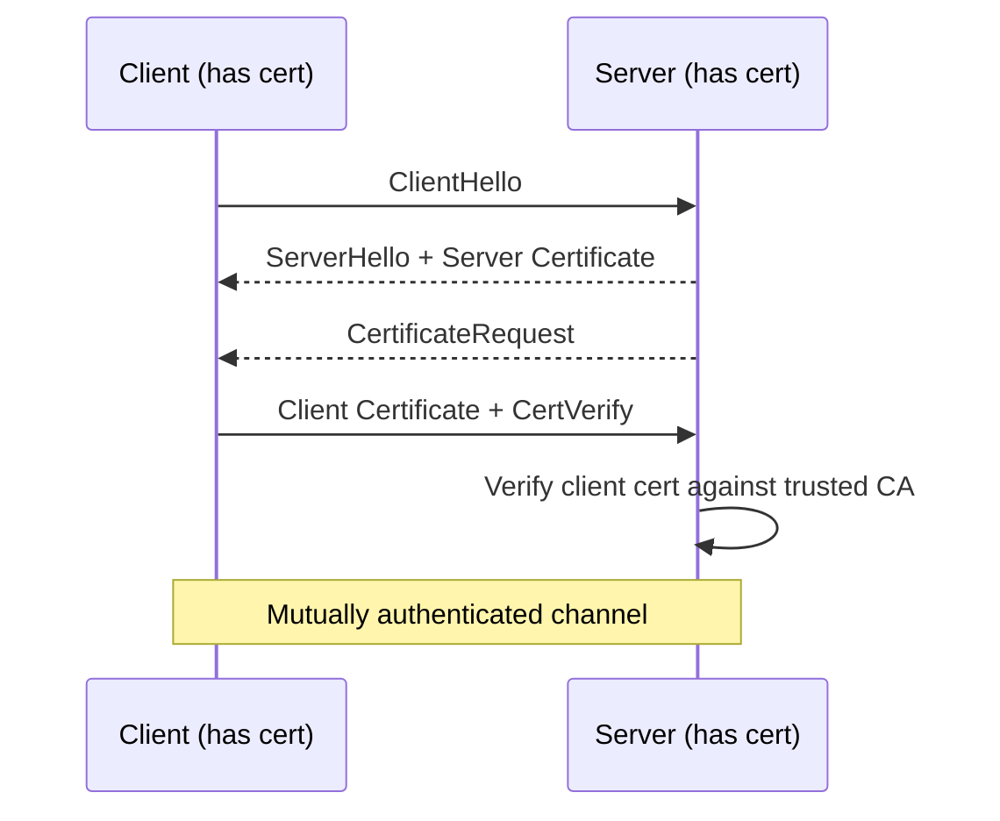

HTTPS = HTTP + TLS. TLS (Transport Layer Security) provides three guarantees: **confidentiality** (encryption), **authentication** (certificates), and **integrity** (MAC). All three are required for a secure connection.

## TLS versions

| Version | Status | Notes |
|---|---|---|
| SSL 2.0 / 3.0 | Broken — never use | POODLE, DROWN attacks |
| TLS 1.0 | Deprecated (RFC 8996) | BEAST attack |
| TLS 1.1 | Deprecated (RFC 8996) | Remove from config |
| TLS 1.2 | Acceptable | Still widely used |
| TLS 1.3 | Recommended | Faster, smaller attack surface |

## TLS 1.3 handshake



**0-RTT resumption:** On reconnect, the client can send data in the first flight using a pre-shared key from the previous session. Beware: 0-RTT data is **replay-vulnerable** — don't use it for non-idempotent operations.

## X.509 Certificates

A certificate binds a public key to an identity and is signed by a Certificate Authority (CA).

```
Certificate:
  Subject: CN=example.com, O=Example Corp, C=US
  Issuer:  CN=Let's Encrypt R3, O=Let's Encrypt
  SAN:     example.com, www.example.com
  Valid:   2024-01-01 → 2024-04-01
  Public Key: RSA 2048 / EC P-256
  Signature: SHA-256withRSA
```

### Certificate chain

```
Root CA (self-signed, in OS/browser trust store)
  └── Intermediate CA (cross-signed)
        └── End-entity cert (your domain)
```

Browsers verify the chain up to a trusted root. Sending the full chain (intermediate included) avoids chain-building failures on clients that don't cache intermediates.

### Subject Alternative Names (SAN)

Modern certs use SANs for multi-domain coverage:
- `example.com`, `www.example.com` — specific names
- `*.example.com` — wildcard (one level only)

### Certificate types

| Type | Validation level | Use case |
|---|---|---|
| DV (Domain Validation) | Domain control only | Most websites, APIs |
| OV (Organization Validation) | Domain + org identity | Business sites |
| EV (Extended Validation) | Strict legal entity check | Financial institutions |

## Certificate lifecycle



**Let's Encrypt** automates this with the ACME protocol. `certbot` handles renewal automatically. Certificates expire after 90 days to incentivise automation.

## Cipher suites

A cipher suite specifies the algorithms for key exchange, authentication, bulk encryption, and MAC.

### TLS 1.3 cipher suites (simplified — no key exchange negotiated here)

```
TLS_AES_256_GCM_SHA384
TLS_AES_128_GCM_SHA256
TLS_CHACHA20_POLY1305_SHA256
```

### TLS 1.2 cipher suite anatomy

```
TLS_ECDHE_RSA_WITH_AES_256_GCM_SHA384
     ↑      ↑        ↑            ↑
  Key exch  Auth  Bulk cipher    MAC/PRF
```

**Always prefer:**
- `ECDHE` (ephemeral ECDH) over `RSA` for key exchange → forward secrecy
- `GCM` or `CHACHA20_POLY1305` (AEAD) over CBC mode
- SHA-256+ over SHA-1

**Avoid:** RC4, 3DES, CBC mode ciphers (BEAST/LUCKY13), export-grade ciphers, NULL suites.

## Forward Secrecy

With RSA key exchange, if the server's private key is later compromised, all past sessions can be decrypted (passive attacker recorded traffic).

With `ECDHE` (Ephemeral Elliptic-curve Diffie-Hellman), a new key pair is generated per session and discarded. Past sessions remain confidential even if the long-term key leaks.

**Always enable ECDHE. TLS 1.3 enforces this.**

## HSTS — HTTP Strict Transport Security

```http
Strict-Transport-Security: max-age=31536000; includeSubDomains; preload
```

Once a browser sees this header:
- Redirects HTTP → HTTPS internally (no roundtrip)
- Prevents certificate errors from being bypassed
- Valid for `max-age` seconds

`preload` submits your domain to the [HSTS preload list](https://hstspreload.org) — browsers ship with it baked in, protecting first-ever visitors.

## Certificate Transparency (CT)

CAs must log every certificate to append-only public logs. Browsers check for SCTs (Signed Certificate Timestamps). This makes rogue certificate issuance detectable.

Monitor your domain at: `https://crt.sh/?q=example.com`

## Certificate Pinning

Pin a specific cert or public key hash in your app to detect MitM even from trusted CAs.

```http
Public-Key-Pins: pin-sha256="base64=="; max-age=5184000; includeSubDomains
```

**HPKP is deprecated** — a single mistake can brick your site. Use **Certificate Transparency monitoring** and/or **CAA DNS records** instead.

### CAA records

```
example.com.  CAA  0 issue "letsencrypt.org"
example.com.  CAA  0 issuewild ";"    ; no wildcards
```

Prevents unauthorized CAs from issuing for your domain.

## Common TLS issues

| Problem | Cause | Fix |
|---|---|---|
| `ERR_CERT_AUTHORITY_INVALID` | Self-signed or untrusted root | Add to trust store or use public CA |
| `ERR_CERT_DATE_INVALID` | Expired cert | Renew; automate renewal |
| `ERR_SSL_PROTOCOL_ERROR` | Version mismatch | Enable TLS 1.2+ on both sides |
| `SSL_ERROR_RX_RECORD_TOO_LONG` | Plain HTTP on HTTPS port | Fix redirect or port |
| Mixed content warning | HTTP resource on HTTPS page | Upgrade all resource URLs |
| `HSTS preload` error | Removed HSTS before preload expiry | Cannot easily undo — plan before adding |

## Nginx TLS configuration example

```nginx
server {
    listen 443 ssl http2;
    server_name example.com;

    ssl_certificate     /etc/letsencrypt/live/example.com/fullchain.pem;
    ssl_certificate_key /etc/letsencrypt/live/example.com/privkey.pem;

    ssl_protocols TLSv1.2 TLSv1.3;
    ssl_ciphers ECDHE-ECDSA-AES128-GCM-SHA256:ECDHE-RSA-AES128-GCM-SHA256:ECDHE-ECDSA-AES256-GCM-SHA384:ECDHE-RSA-AES256-GCM-SHA384:ECDHE-ECDSA-CHACHA20-POLY1305:ECDHE-RSA-CHACHA20-POLY1305;
    ssl_prefer_server_ciphers off;  # Let client pick in TLS 1.3

    ssl_session_timeout 1d;
    ssl_session_cache shared:SSL:10m;
    ssl_session_tickets off;  # Forward secrecy

    add_header Strict-Transport-Security "max-age=63072000; includeSubDomains; preload" always;
}
```

## mTLS — Mutual TLS

In standard TLS, only the server presents a certificate. In mTLS, **both** parties authenticate with certificates. Used for service-to-service communication inside a cluster (service mesh) and B2B APIs.


