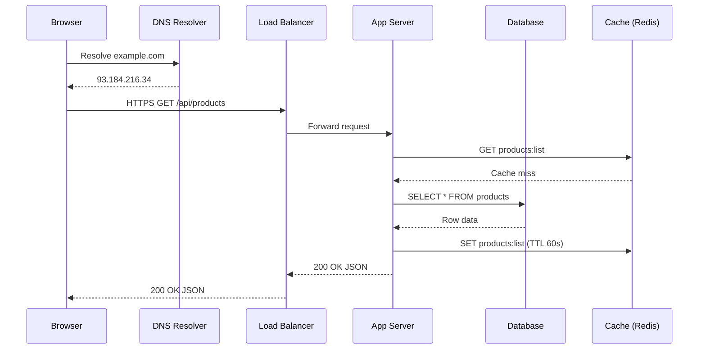

---
title: "Web Development Overview"
description: "A comprehensive reference for modern web development — from HTTP fundamentals to distributed architectures and API design."
---

import { Tabs, TabItem } from '@astrojs/starlight/components';
import { Aside, Card, CardGrid, Steps, Badge } from '@astrojs/starlight/components';

Web development spans everything from the raw bytes flowing through a TCP socket to the React component a user clicks in their browser. This section organises that knowledge into six coherent areas so you can navigate from fundamentals to advanced architecture without losing context.

## What's covered

| Area | Topics |
|---|---|
| **Web & HTTP** | DNS resolution, TCP handshake, HTTP/1.1–3, HTTPS & TLS |
| **Frontend** | Browser rendering pipeline, JS runtime, CSS layout, performance |
| **Backend** | Server-side architecture, request lifecycle, DB connections, ORMs |
| **Hosting & Deployment** | Web servers, cloud hosting, CI/CD, containers |
| **Architecture** | Monoliths, microservices, distributed systems, scalability, HA, caching, load balancing |
| **APIs & Integration** | REST, GraphQL, gRPC, WebSockets, event-driven, API management & security |

## The full request journey

## Key mental models

**Separation of concerns** — frontend (presentation), backend (logic), database (state) are distinct layers with defined interfaces. Each can scale independently.

**Statelessness** — HTTP is stateless by design. Sessions, tokens, and caches are mechanisms built *on top* of a stateless protocol, not part of it.

**Everything is a trade-off** — consistency vs. availability, latency vs. throughput, developer velocity vs. operational complexity. The right choice depends on your SLOs and team size.

**The build pipeline is part of the product** — CI/CD, IaC, and observability are first-class concerns, not afterthoughts.
